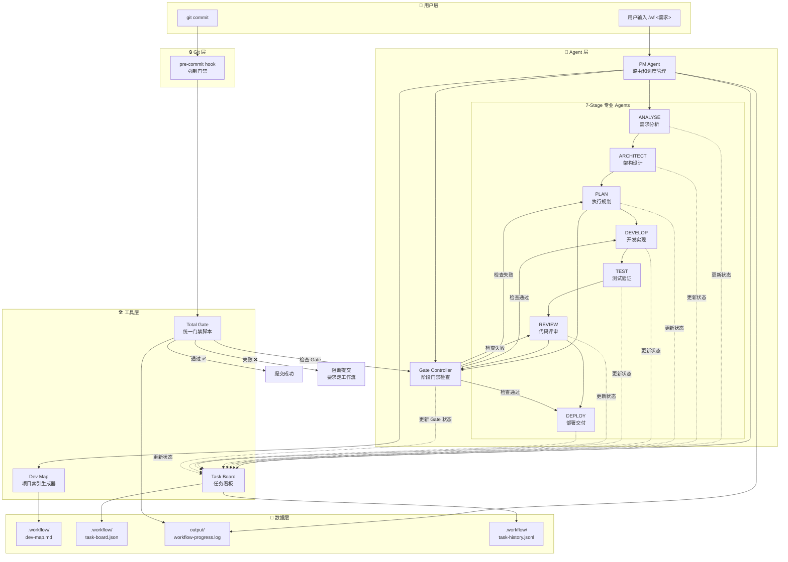
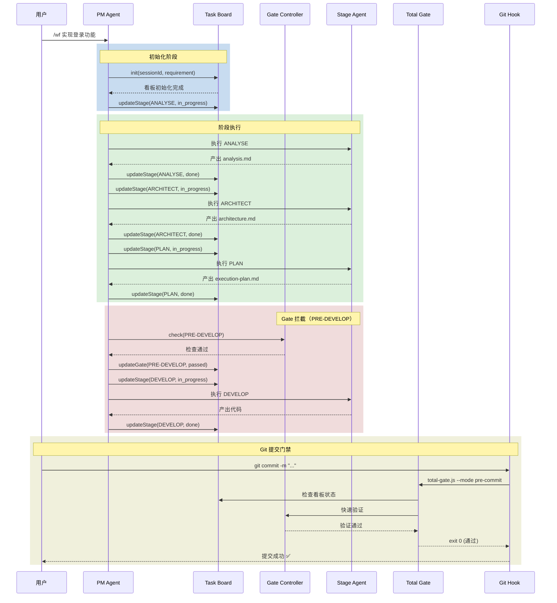
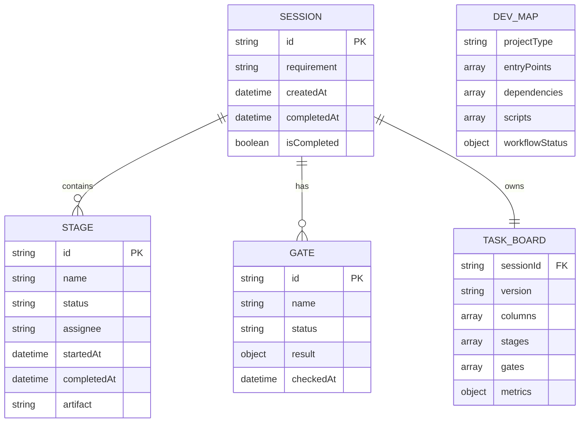
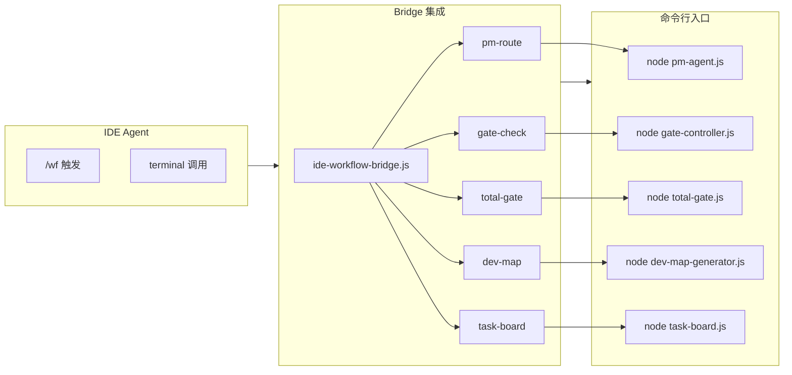
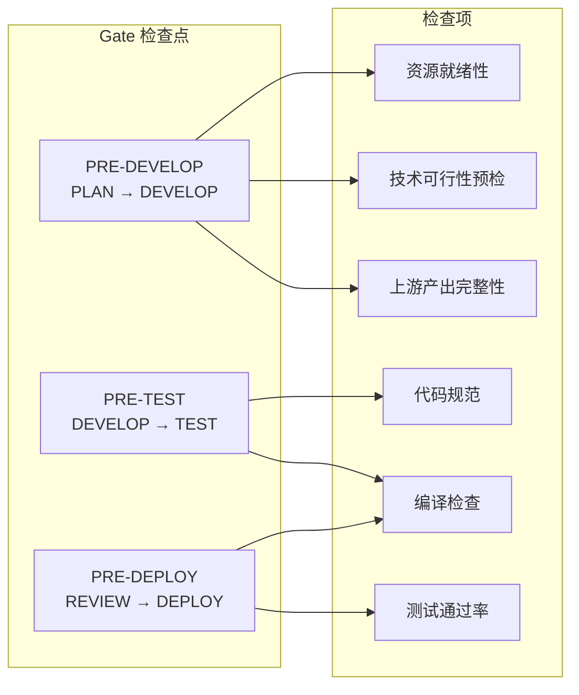

# 方案 A 架构图

## 整体架构

```mermaid
flowchart TB
    subgraph User["👤 用户层"]
        U1["用户输入 /wf <需求>"]
        U2["git commit"]
    end

    subgraph Agents["🤖 Agent 层"]
        PM["PM Agent<br/>路由和进度管理"]
        GC["Gate Controller<br/>阶段门禁检查"]
        
        subgraph StageAgents["7-Stage 专业 Agents"]
            A1["ANALYSE<br/>需求分析"]
            A2["ARCHITECT<br/>架构设计"]
            A3["PLAN<br/>执行规划"]
            A4["DEVELOP<br/>开发实现"]
            A5["TEST<br/>测试验证"]
            A6["REVIEW<br/>代码评审"]
            A7["DEPLOY<br/>部署交付"]
        end
    end

    subgraph Tools["🛠️ 工具层"]
        DM["Dev Map<br/>项目索引生成器"]
        TB["Task Board<br/>任务看板"]
        TG["Total Gate<br/>统一门禁脚本"]
    end

    subgraph Data["💾 数据层"]
        PB[".workflow/<br/>dev-map.md"]
        PT[".workflow/<br/>task-board.json"]
        PL["output/<br/>workflow-progress.log"]
        PH[".workflow/<br/>task-history.jsonl"]
    end

    subgraph Git["🔒 Git 层"]
        GH["pre-commit hook<br/>强制门禁"]
    end

    %% 用户到 PM
    U1 --> PM
    
    %% PM 到各组件
    PM --> DM
    PM --> TB
    PM --> A1
    PM --> GC
    
    %% 7-Stage 流水线
    A1 --> A2 --> A3 --> A4 --> A5 --> A6 --> A7
    
    %% Gate Controller 在关键点拦截
    A3 --> GC
    GC -->|检查通过| A4
    GC -->|检查失败| A3
    
    A6 --> GC
    GC -->|检查通过| A7
    GC -->|检查失败| A6
    
    %% 数据流
    DM --> PB
    TB --> PT
    TB --> PH
    PM --> PL
    
    %% 7-Stage 更新 Task Board
    A1 -.->|更新状态| TB
    A2 -.->|更新状态| TB
    A3 -.->|更新状态| TB
    A4 -.->|更新状态| TB
    A5 -.->|更新状态| TB
    A6 -.->|更新状态| TB
    A7 -.->|更新状态| TB
    
    %% Gate 更新
    GC -.->|更新 Gate 状态| TB
    
    %% Git 提交流程
    U2 --> GH
    GH --> TG
    TG --> PL
    TG -->|检查 Gate| GC
    
    %% 阻塞/通过决策
    TG -->|通过 ✅| COMMIT["提交成功"]
    TG -->|失败 ❌| BLOCK["阻断提交<br/>要求走工作流"]
```

## 组件交互流程

```mermaid
sequenceDiagram
    participant U as 用户
    participant PM as PM Agent
    participant TB as Task Board
    participant GC as Gate Controller
    participant Stage as Stage Agent
    participant TG as Total Gate
    participant Git as Git Hook

    U->>PM: /wf 实现登录功能
    
    rect rgb(200, 220, 240)
        Note over PM,TB: 初始化阶段
        PM->>TB: init(sessionId, requirement)
        TB-->>PM: 看板初始化完成
        PM->>TB: updateStage(ANALYSE, in_progress)
    end

    rect rgb(220, 240, 220)
        Note over PM,Stage: 阶段执行
        PM->>Stage: 执行 ANALYSE
        Stage-->>PM: 产出 analysis.md
        PM->>TB: updateStage(ANALYSE, done)
        PM->>TB: updateStage(ARCHITECT, in_progress)
        PM->>Stage: 执行 ARCHITECT
        Stage-->>PM: 产出 architecture.md
        PM->>TB: updateStage(ARCHITECT, done)
        PM->>TB: updateStage(PLAN, in_progress)
        PM->>Stage: 执行 PLAN
        Stage-->>PM: 产出 execution-plan.md
        PM->>TB: updateStage(PLAN, done)
    end

    rect rgb(240, 220, 220)
        Note over GC,Stage: Gate 拦截（PRE-DEVELOP）
        PM->>GC: check(PRE-DEVELOP)
        GC-->>PM: 检查通过
        PM->>TB: updateGate(PRE-DEVELOP, passed)
        PM->>TB: updateStage(DEVELOP, in_progress)
        PM->>Stage: 执行 DEVELOP
        Stage-->>PM: 产出代码
        PM->>TB: updateStage(DEVELOP, done)
    end

    rect rgb(240, 240, 220)
        Note over U,Git: Git 提交门禁
        U->>Git: git commit -m "..."
        Git->>TG: total-gate.js --mode pre-commit
        TG->>TB: 检查看板状态
        TG->>GC: 快速验证
        GC-->>TG: 验证通过
        TG-->>Git: exit 0 (通过)
        Git-->>U: 提交成功 ✅
    end
```

## 数据模型

```mermaid
erDiagram
    SESSION ||--o{ STAGE : contains
    SESSION ||--o{ GATE : has
    SESSION ||--|| TASK_BOARD : owns
    
    SESSION {
        string id PK
        string requirement
        datetime createdAt
        datetime completedAt
        boolean isCompleted
    }
    
    STAGE {
        string id PK
        string name
        string status
        string assignee
        datetime startedAt
        datetime completedAt
        string artifact
    }
    
    GATE {
        string id PK
        string name
        string status
        object result
        datetime checkedAt
    }
    
    TASK_BOARD {
        string sessionId FK
        string version
        array columns
        array stages
        array gates
        object metrics
    }
    
    DEV_MAP {
        string projectType
        array entryPoints
        array dependencies
        array scripts
        object workflowStatus
    }
```

## 调用链

```mermaid
flowchart LR
    subgraph CLI["命令行入口"]
        C1["node pm-agent.js"]
        C2["node gate-controller.js"]
        C3["node total-gate.js"]
        C4["node dev-map-generator.js"]
        C5["node task-board.js"]
    end
    
    subgraph Bridge["Bridge 集成"]
        B["ide-workflow-bridge.js"]
        B1["pm-route"]
        B2["gate-check"]
        B3["total-gate"]
        B4["dev-map"]
        B5["task-board"]
    end
    
    subgraph IDE["IDE Agent"]
        I1["/wf 触发"]
        I2["terminal 调用"]
    end
    
    IDE --> Bridge
    Bridge --> CLI
    
    B --> B1 & B2 & B3 & B4 & B5
    B1 --> C1
    B2 --> C2
    B3 --> C3
    B4 --> C4
    B5 --> C5
```

## 关键检查点

```mermaid
flowchart LR
    subgraph Gates["Gate 检查点"]
        G1["PRE-DEVELOP<br/>PLAN → DEVELOP"]
        G2["PRE-TEST<br/>DEVELOP → TEST"]
        G3["PRE-DEPLOY<br/>REVIEW → DEPLOY"]
    end
    
    subgraph Checks["检查项"]
        C1["上游产出完整性"]
        C2["技术可行性预检"]
        C3["资源就绪性"]
        C4["编译检查"]
        C5["代码规范"]
        C6["测试通过率"]
    end
    
    G1 --> C1 & C2 & C3
    G2 --> C4 & C5
    G3 --> C6 & C4
```

---

*方案 A 架构图 - WorkFlowAgent 渐进式吸收*
