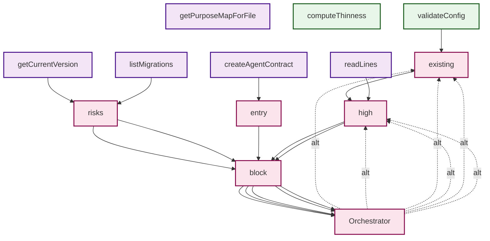
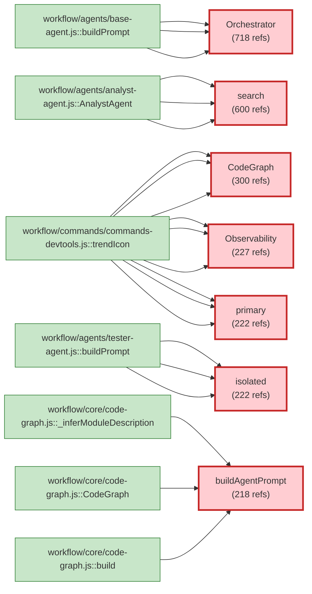
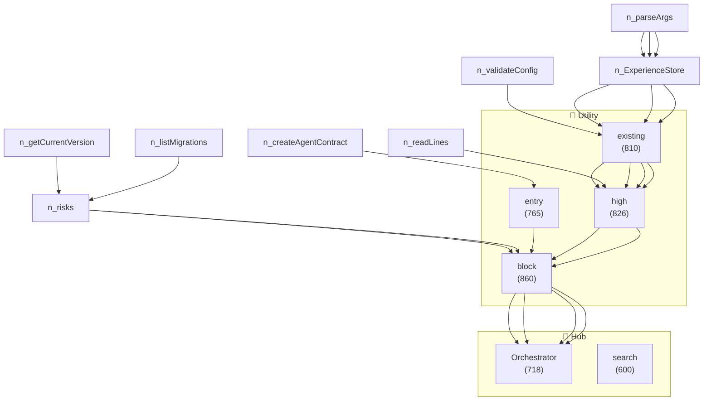
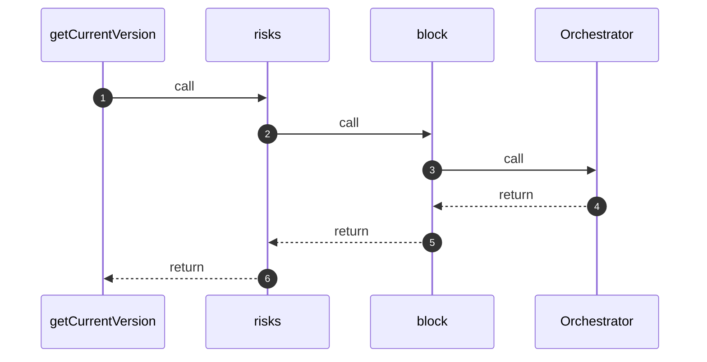
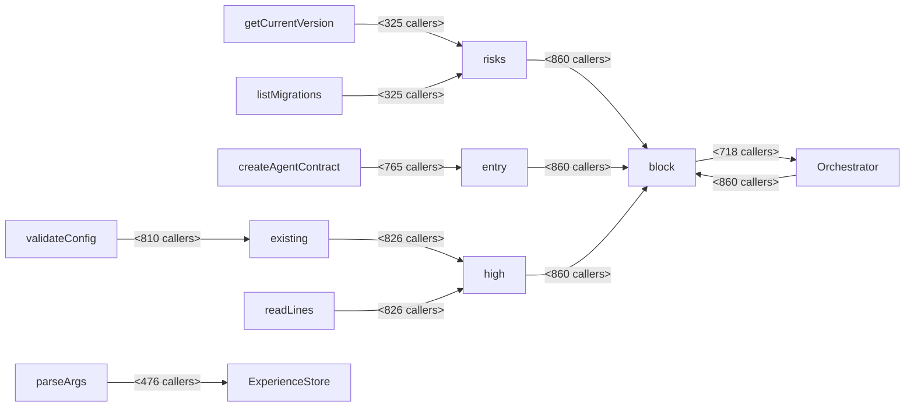

## 📊 Business Logic Diagrams

> Generated: 2026-03-24
> View in VS Code, GitHub, or any Mermaid-compatible viewer

### 🚪 Entry Point Flow Diagram

> Shows business flows from entry points (max 5 flows, depth 4)

### 🏗️ Core Service Dependency Diagram

> Shows core services and their top callers (max 7 services)

### 📈 Call Graph Overview

> Shows top connected symbols (high in-degree = widely used)

### 🔄 Top Business Flow Sequence

> Sequence diagram for: **getCurrentVersion**

> **Alternative paths:** 8 branches detected
> - `Orchestrator` → `existing` (depth: 2)
> - `Orchestrator` → `high` (depth: 2)
> - `block` → `search` (depth: 1)

### 📊 Data Flow Diagram

> Shows parameter/data flow between functions

---

### 📌 How to View

1. **VS Code**: Install "Markdown Preview Mermaid Support" extension
2. **GitHub**: Diagrams render automatically in .md files
3. **Online**: Paste at [Mermaid Live Editor](https://mermaid.live/)
4. **Notion**: Use Mermaid code block
