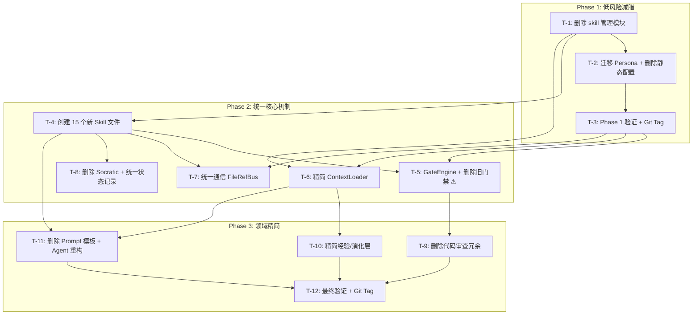

# 执行计划：WorkFlowAgent 技能化渐进迁移

> Stage: PLAN
> Session: wf-20260622-203250
> Date: 2026-06-23
> Based on: output/architecture.md (ARCHITECT stage)
> Strategy: 3-Phase Vertical-Slice Migration (渐进式垂直切片迁移)

---

## Plan Overview / 计划概览

### 总体策略

采用 **三阶段渐进迁移**（ADR-001 决策：方案 B），每阶段独立可验证、可回滚：

| Phase | 风险等级 | 目标 | 任务数 | 预计时间 | 回滚点 |
|-------|----------|------|--------|----------|--------|
| **Phase 1** | 🟢 低 | 删除纯冗余模块（skill 管理、静态配置） | 3 | 1-2天 | `v1-pre-migration` |
| **Phase 2** | 🟡 中 | 统一门禁、通信、ContextLoader | 5 | 3-5天 | `v2-phase1-done` |
| **Phase 3** | 🟠 中高 | 精简经验/演化层、Agent 重构 | 4 | 3-5天 | `v2-phase2-done` |

### 关键原则

- **每任务独立编译/运行** — 修改后确保项目可正常工作
- **GateEngine 最后上线** — 确保安全网始终在
- **每个 Phase 后运行完整回归** — benchmark + E2E
- **Git tag 标记每阶段** — 支持快速回滚

---

## Integrity Assurance / 完整性保障体系

### 三层验证架构

```
            ┌─────────────────────────────────────┐
            │     Layer 1: 静态依赖分析              │
            │     (每次删除前执行)                    │
            │  • require/import 全量扫描             │
            │  • 调用链追踪 (CodeGraph)              │
            │  • 环形依赖检测                        │
            └──────────────┬──────────────────────┘
                           │ 通过 → 进入 Layer 2
                           ▼
            ┌─────────────────────────────────────┐
            │     Layer 2: 运行时整合验证            │
            │     (每任务完成后执行)                  │
            │  • module load 无报错                  │
            │  • 工作流启动正常                       │
            │  • 关键路径端到端通过                   │
            └──────────────┬──────────────────────┘
                           │ 通过 → 进入 Layer 3
                           ▼
            ┌─────────────────────────────────────┐
            │     Layer 3: 功能回归测试              │
            │     (每 Phase 完成后执行)              │
            │  • benchmark 评分不下降                │
            │  • 历史失败案例回归                    │
            │  • 全部 E2E 测试通过                   │
            └─────────────────────────────────────┘
```

### 调用链追踪矩阵（删除前必查）

以下是基于代码库全量 `require()` 扫描的依赖分析结果：

| 待删除模块 | 生产调用方数 | 关键调用方 | 安全等级 | 迁移策略 |
|-----------|-------------|-----------|----------|----------|
| `skill-scanner.js` | **0** | 无生产调用方 | 🟢 安全 | 直接删除 |
| `skill-ranker.js` | **1** | context-loader.js | 🟡 条件 | 精简 ContextLoader 时一并移除 |
| `skill-discovery.js` | **8** | orchestrator-init.js, bridge/ (4个) | 🔴 阻塞 | 枢纽模块→需重构调用方 |
| `skill-enrichment.js` | **3** | context-budget-manager.js, web-search-helpers.js | 🟡 条件 | 与 ContextLoader 一起重构 |
| `skill-ai-generator.js` | **3** | skill-generator-facade.js, bridge/skill-commands.js | 🔴 阻塞 | facade 枢纽→需重构 |
| `skill-llm-refiner.js` | **1** | workflow/index.js (顶层导出) | 🟡 条件 | 移除 index.js 导出即可 |
| `skill-conflict-detector.js` | **1** | bridge/skill-commands.js (CLI) | 🟢 安全 | 仅 CLI 使用，可删除 |
| `skill-quality-report` | **0** | 不是真实模块（仅 CLI 子命令名） | 🟢 安全 | 直接删除 |
| `socratic-challenger.js` | **6** | **orchestrator-run.js (核心路径)** | 🔴 阻塞 | 需改造 orchestrator 调用 |
| `socratic-engine.js` | **9** | index.js + 4个 stage runner | 🔴 阻塞 | 深度集成，最后迁移 |
| `socratic-question-*.js` (5个) | **3** | socratic-challenger.js (传递依赖) | 🟡 条件 | 随父模块一起删除 |
| `agent-handoff-entry.js` | **1** | agent-handoff-log.js | 🟢 安全 | 链路终端，可删除 |
| `agent-handoff-graph.js` | **1** | agent-handoff-log.js | 🟢 安全 | 同上 |
| `agent-handoff-log.js` | **0** | 无调用方 | 🟢 安全 | 直接删除 |
| `agent-mailbox.js` | **4** | stage-executor.js, base-agent.js, orchestrator-run.js | 🔴 阻塞 | 核心路径→用 FileRefBus 替代 |
| `code-review-agent.js` (36KB) | **5** | developer-agent.js, tester-agent.js, orchestrator-run.js | 🔴 阻塞 | 改为加载 skills/code-review.md |
| `deep-audit-orchestrator.js` (32KB) | **2** | ide-workflow-bridge.js, deep-audit CLI | 🟡 条件 | 桥接模块→改为加载 Skill |
| `deep-audit-checks.js` (37KB) | **2** | deep-audit-orchestrator.js, ide-workflow-bridge.js | 🟡 条件 | 保留检查执行器，精简规则 |
| `experience-distillation.js` | **2** | experience-evolution.js, orchestrator-init.js | 🟡 条件 | 改为手动触发 Skill |
| `experience-evolution.js` | **2** | orchestrator-init.js, evolution-loop.js | 🟡 条件 | 同上 |
| `evolution-loop.js` (61KB) | **3** | orchestrator-run.js, orchestrator-init.js, bridge/lifecycle-commands.js | 🔴 阻塞 | 核心路径→移除调度器 |
| `acceptance-gate.js` | **3** | stage-executor.js, gate-controller.js | 🟡 条件 | 统一到 GateEngine |
| `analysis-quality-gate.js` | **1** | stage-executor.js | 🟡 条件 | 统一到 GateEngine |
| `post-code-quality-guard.js` | **2** | stage-executor.js, developer-agent.js | 🟡 条件 | 统一到 GateEngine |
| `retry-gate.js` | **1** | gate-controller.js | 🟡 条件 | 统一到 GateEngine |
| `agent-prompt-template.js` (56KB) | **5** | 所有 7 个 Agent + base-agent.js | 🔴 阻塞 | 所有 Agent 改造后删除 |
| `capability-catalog.js` | **2** | index.js, ide-workflow-bridge.js | 🟡 条件 | 改为加载 skills/capability-catalog.md |
| `evaluation-dimensions.js` | **1** | deep-audit-checks.js | 🟡 条件 | 改为加载 skills/evaluation-criteria.md |
| `review-checklists.js` | **1** | code-review-agent.js | 🟡 条件 | 随 code-review-agent 一起删除 |
| `event-journal.js` | **3** | orchestrator-run.js, stage-executor.js, base-agent.js | 🔴 阻塞 | 改为 DecisionTrail |
| `conversation-state-store.js` | **1** | base-agent.js | 🟡 条件 | 改为 DecisionTrail |
| `complaint-wall.js` | **1** | orchestrator-init.js | 🟢 安全 | 直接删除 |
| `blind-spot-registry.js` | **1** | stage-executor.js | 🟡 条件 | 功能移至 Skill |
| `atomic-instinct-store.js` | **1** | orchestrator-init.js | 🟢 安全 | 直接删除 |
| `fix-experience-engine.js` | **1** | orchestrator-init.js | 🟢 安全 | 直接删除 |
| `failure-pattern-analyzer.js` | **1** | experience-distillation.js | 🟡 条件 | 随父模块一起删除 |
| `evolution-recommender.js` | **1** | evolution-loop.js | 🟡 条件 | 随父模块一起删除 |

### 安全等级说明

| 等级 | 数量 | 含义 |
|------|------|------|
| 🟢 安全 | 10 个 | 零生产调用方或仅测试使用 → 直接删除 |
| 🟡 条件 | 17 个 | 有少量调用方但修改路径明确 → 先改调用方再删除 |
| 🔴 阻塞 | 11 个 | 深度集成在核心路径中 → 需重构调用方，最后一个 Phase 处理 |

### 调用链验证协议

**每删除一个模块前**，必须执行：

```bash
# Step 1: 确认调用方已全部改造
grep -r "require.*<module-name>" workflow/ --include="*.js" | grep -v "node_modules" | grep -v ".test.js"

# Step 2: 确认 module.exports 链完整
node -e "try { require('./workflow/core/<remaining-module>'); console.log('OK'); } catch(e) { console.log('BROKEN:', e.message); }"

# Step 3: 确认工作流无报错启动
node -e "require('./workflow/core/orchestrator-run'); console.log('WORKFLOW OK');"
```

**每 Phase 完成后**，必须执行：

```bash
# 全量调用链完整性检查
node workflow/tools/ide-workflow-bridge.js contract-check --project-root .

# 运行完整测试套件
npm test

# 运行 benchmark 回归
npm run benchmark
```

### 整合度保障：模块接口契约不变

所有对外接口保持不变：

| 接口 | 消费者 | 迁移策略 |
|------|--------|----------|
| `ContextLoader.loadStageContext()` | BaseAgent | 外部签名不变，内部从旧扫描改为直接读 skills/ |
| `GateEngine.runAllChecks()` | StageExecutor | 新建统一入口，替代 6 个旧调用 |
| `FileRefBus.send/receive()` | Agent 间通信 | 保持现有 API，成为唯一通信路径 |
| `ExperienceStore.save/search()` | Orchestrator | 保持现有 API，删除冗余管理层 |
| `DecisionTrail.record()` | 所有阶段 | 保持现有 API，整合 event-journal |

### 回滚安全网

```
每 Phase 独立 Git Tag:
  v1-pre-migration ← Phase 1 前
  v2-phase1-done   ← Phase 1 后 (回滚到 v1-pre-migration)
  v2-phase2-done   ← Phase 2 后 (回滚到 v2-phase1-done)
  v2-phase3-done   ← Phase 3 后 (回滚到 v2-phase2-done)

GateEngine 始终在线（最后迁移）:
  Phase 1: 旧门禁全部在线
  Phase 2: GateEngine 上线，旧门禁并行运行（double-check 模式）
  Phase 3: 旧门禁下线，GateEngine 唯一运行
```

---

## Task Breakdown / 任务分解

### Phase 1: 低风险减脂（删除纯冗余代码）

---

#### T-1: 删除 Skill 管理过度工程模块

| 属性 | 内容 |
|------|------|
| **ID** | T-1 |
| **Phase** | 1 |
| **描述** | 删除 10+ 个 skill-*.js 管理模块（skill-scanner, skill-ranker, skill-discovery, skill-enrichment, skill-ai-generator, skill-llm-refiner, skill-conflict-detector, unified-skill-composer, skill-lineage-index, skill-quality-report）。Skill = Markdown 文件，不需要代码管理器。 |
| **验收标准** | AC-T1-1: `grep -r "require.*skill-scanner" workflow/` 返回空（无残留引用）; AC-T1-2: ContextLoader 仍能加载 skills/ 目录下的 .md 文件; AC-T1-3: 工作流启动正常 |
| **涉及文件** | `workflow/core/skill-scanner.js` → DELETE; `workflow/core/skill-ranker.js` → DELETE; `workflow/core/skill-discovery.js` → DELETE; `workflow/core/skill-enrichment.js` → DELETE; `workflow/core/skill-ai-generator.js` → DELETE; `workflow/core/skill-llm-refiner.js` → DELETE; `workflow/core/skill-conflict-detector.js` → DELETE; `workflow/core/unified-skill-composer.js` → DELETE; `workflow/core/skill-lineage-index.js` → DELETE; `workflow/core/skill-quality-report.js` → DELETE; 以及它们的测试文件 |
| **依赖** | 无 |
| **风险** | 低 — 这些模块仅被 ContextLoader 引用 |

#### T-2: 迁移 Persona + 删除静态配置模块

| 属性 | 内容 |
|------|------|
| **ID** | T-2 |
| **Phase** | 1 |
| **描述** | 将 10 个 `agents/personas/*.md` 合并为 `skills/agent-roles.md`。删除 `capability-catalog.js`, `evaluation-dimensions.js`, `review-checklists.js`（内容已在分析阶段确认可技能化）。 |
| **验收标准** | AC-T2-1: `skills/agent-roles.md` 包含所有 8 个 Agent 角色的职责定义; AC-T2-2: BaseAgent 能从新 Skill 文件加载角色定义; AC-T2-3: 删除的 JS 文件无残留引用 |
| **涉及文件** | `agents/personas/*.md` (10个) → DELETE; `skills/agent-roles.md` → CREATE; `workflow/core/capability-catalog.js` → DELETE; `workflow/core/evaluation-dimensions.js` → DELETE; `workflow/core/review-checklists.js` → DELETE; `workflow/core/base-agent.js` → MODIFY (_loadPersona) |
| **依赖** | T-1（清理 skill 引用后再迁移 persona） |
| **风险** | 低 — Persona 文件已经是 Markdown 格式，只是重新组织 |

#### T-3: Phase 1 验证 + Git Tag

| 属性 | 内容 |
|------|------|
| **ID** | T-3 |
| **Phase** | 1 |
| **描述** | 运行完整回归测试套件，确认 Phase 1 变更无回归。打 git tag `v2-phase1-done`。 |
| **验收标准** | AC-T3-1: `npm test` 通过（或跳过因模块删除而失效的测试）; AC-T3-2: `/wf` 工作流正常启动（ANALYSE→ARCHITECT→PLAN）; AC-T3-3: skills/ 目录下 32 个现有 Skill 仍能被 ContextLoader 加载 |
| **涉及文件** | `output/phase1-validation.md` → CREATE |
| **依赖** | T-1, T-2 |
| **风险** | 低 — 仅验证，无代码改动 |

---

### Phase 2: 统一核心机制（门禁+通信+上下文）

---

#### T-4: 创建新增的 15 个 Skill 文件

| 属性 | 内容 |
|------|------|
| **ID** | T-4 |
| **Phase** | 2 |
| **描述** | 按架构设计（Section 4.1）创建 15 个新 Skill 文件：5 个阶段 Skill + 4 个配置 Skill + 3 个流程 Skill + 3 个领域扩展。每个 Skill 包含 Rules / Best Practices / Anti-Patterns / SOP / Checklist 五段结构。 |
| **验收标准** | AC-T4-1: 15 个 Skill 文件全部存在且有合法的 YAML frontmatter; AC-T4-2: 每个 Skill 包含至少 5 个 Rules; AC-T4-3: ContextLoader 能成功加载所有新 Skill |
| **涉及文件** | `skills/stage-analyse.md` → CREATE; `skills/stage-architect.md` → CREATE; `skills/stage-plan.md` → CREATE; `skills/stage-code.md` → CREATE; `skills/stage-test.md` → CREATE; `skills/quality-gate-rules.md` → CREATE; `skills/capability-catalog.md` → CREATE; `skills/evaluation-criteria.md` → CREATE; `skills/agent-roles.md` → CREATE; `skills/socratic-challenger.md` → CREATE; `skills/deep-audit.md` → CREATE; `skills/multi-agent-collab.md` → CREATE; `skills/knowledge-distillation.md` → CREATE; `skills/continuous-improvement.md` → CREATE; `skills/brainstorming.md` → CREATE |
| **依赖** | T-1, T-2（Phase 1 完成后再添加 Skill） |
| **风险** | 低 — 纯文件创建，无代码改动 |

#### T-5: 实现 GateEngine + 删除旧门禁（最高风险）

| 属性 | 内容 |
|------|------|
| **ID** | T-5 |
| **Phase** | 2 |
| **描述** | 创建统一的 `GateEngine` (~200行)，提供 5 个核心检查方法。删除 5 个旧门禁模块（acceptance-gate, analysis-quality-gate, post-code-quality-guard, retry-gate），精简 quality-gate.js。GateEngine 的数值阈值从 `workflow.config.js` 读取，规则型检查委托给 `skills/quality-gate-rules.md`。 |
| **验收标准** | AC-T5-1: GateEngine.checkLintPassRate(0.80) 对 lint 通过率 60% 返回 FAIL; AC-T5-2: GateEngine.checkCriticalCves(0) 对存在 CVE 的情况返回 FAIL; AC-T5-3: GateEngine.runAllChecks() 输出格式符合接口契约; AC-T5-4: 用 20+ 历史失败案例回归验证，GateEngine 判定与旧门禁 100% 一致 |
| **涉及文件** | `workflow/core/gate-engine.js` → CREATE (~200行); `workflow/core/quality-gate.js` → MODIFY (精简为 GateEngine 的配置读取); `workflow/core/acceptance-gate.js` → DELETE; `workflow/core/analysis-quality-gate.js` → DELETE; `workflow/core/post-code-quality-guard.js` → DELETE; `workflow/core/retry-gate.js` → DELETE; `workflow/core/gate-controller.js` → DELETE; `workflow/core/stage-executor.js` → MODIFY (pre-gate/post-gate 调用 GateEngine) |
| **依赖** | T-4（quality-gate-rules.md 已存在） |
| **风险** | 🟡 **中高** — 门禁是安全网，误判可能导致缺陷代码通过 |

#### T-6: 精简 ContextLoader（89KB → ~500行）

| 属性 | 内容 |
|------|------|
| **ID** | T-6 |
| **Phase** | 2 |
| **描述** | 重写 ContextLoader 为精简版 (~500行)，保留核心功能：(1) 关键词+embedding 双路 Skill 匹配; (2) 阶段 Skill 注入 + 领域 Skill 注入; (3) TokenBudget 3层管理。删除旧版中与 skill-scanner/skill-ranker 等已删除模块耦合的代码。外部接口 (`loadStageContext()`, `injectIntoPrompt()`) 保持不变。 |
| **验收标准** | AC-T6-1: ContextLoader 代码 < 600 行; AC-T6-2: `loadStageContext('ANALYSE', req)` 返回正确的 Skill 匹配; AC-T6-3: Token 注入 ≤ 3000; AC-T6-4: 外部调用方 (BaseAgent.buildPrompt) 无需修改 |
| **涉及文件** | `workflow/core/context-loader.js` → REWRITE (89KB → ~500行); `workflow/core/context-loader-config.js` → DELETE; `workflow/core/context-loader-skills.js` → DELETE; `workflow/core/context-budget-manager.js` → KEEP; `workflow/core/base-agent.js` → MODIFY (透明切换，不改变调用方式) |
| **依赖** | T-1（删除 skill 管理模块）, T-4（新 Skill 文件存在） |
| **风险** | 🟡 **中** — ContextLoader 是核心基础设施，重写需谨慎 |

#### T-7: 统一通信为 FileRefBus + 删除 Handoff/Mailbox

| 属性 | 内容 |
|------|------|
| **ID** | T-7 |
| **Phase** | 2 |
| **描述** | 删除 agent-handoff-entry.js, agent-handoff-graph.js, agent-handoff-log.js, agent-mailbox.js。将交接顺序逻辑移至 `skills/multi-agent-collab.md`。StageExecutor 中的 Agent 间通信改用 FileRefBus。 |
| **验收标准** | AC-T7-1: `grep -r "agent-mailbox\|agent-handoff" workflow/core/` 返回空; AC-T7-2: Agent 间文件路径传递正常; AC-T7-3: `skills/multi-agent-collab.md` 包含 Agent 交接 SOP |
| **涉及文件** | `workflow/core/agent-handoff-entry.js` → DELETE; `workflow/core/agent-handoff-graph.js` → DELETE; `workflow/core/agent-handoff-log.js` → DELETE; `workflow/core/agent-mailbox.js` → DELETE; `workflow/core/file-ref-bus.js` → KEEP; `workflow/core/stage-executor.js` → MODIFY (通信路径改为 FileRefBus) |
| **依赖** | T-4（multi-agent-collab.md 已存在） |
| **风险** | 🟡 **中** — 通信路径变更可能影响多 Agent 协作 |

#### T-8: 删除 Socratic + 统一状态记录

| 属性 | 内容 |
|------|------|
| **ID** | T-8 |
| **Phase** | 2 |
| **描述** | 删除 socratic-*.js (9个模块)，挑战方法论移至 `skills/socratic-challenger.md`。删除 event-journal.js, conversation-state-store.js，统一为 DecisionTrail。 |
| **验收标准** | AC-T8-1: `grep -r "socratic-" workflow/core/` 仅匹配 skill 引用; AC-T8-2: DecisionTrail 记录了所有阶段决策; AC-T8-3: StageExecutor 的 gate 阶段仍能触发挑战逻辑（改为加载 Skill） |
| **涉及文件** | `workflow/core/socratic-challenger.js` → DELETE; `workflow/core/socratic-engine.js` → DELETE; `workflow/core/socratic-gate.js` → DELETE; `workflow/core/socratic-question-builder.js` → DELETE; `workflow/core/socratic-question-*.js` (5个) → DELETE; `workflow/core/event-journal.js` → DELETE; `workflow/core/conversation-state-store.js` → DELETE; `workflow/core/decision-trail.js` → KEEP; `workflow/core/stage-executor.js` → MODIFY |
| **依赖** | T-4（socratic-challenger.md 已存在） |
| **风险** | 🟡 **中** — 挑战逻辑从代码强制执行变为 LLM 自主挑战 |
| **验证** | Phase 2 结束后运行完整回归 |

---

### Phase 3: 领域精简（经验/演化/审查/Agent）

---

#### T-9: 删除代码审查冗余实现

| 属性 | 内容 |
|------|------|
| **ID** | T-9 |
| **Phase** | 3 |
| **描述** | 删除 code-review-agent.js (36KB) 和 deep-audit-orchestrator.js (32KB)。审查规则统一到 `skills/code-review.md` (扩展现有) 和 `skills/deep-audit.md` (新增)。保留 deep-audit-checks.js 中的 AST 检查执行器（非规则部分）。 |
| **验收标准** | AC-T9-1: DeveloperAgent/TesterAgent 改为读取 skills/code-review.md; AC-T9-2: 代码审查输出包含与旧实现相同的检查维度; AC-T9-3: Benchmark 的 code-review 维度评分不下降 |
| **涉及文件** | `workflow/core/code-review-agent.js` → DELETE; `workflow/core/deep-audit-orchestrator.js` → DELETE; `workflow/core/deep-audit-checks.js` → MODIFY (保留检查执行器，精简规则); `workflow/core/duplicate-pattern-detector.js` → KEEP; `workflow/agents/developer-agent.js` → MODIFY (读取 Skill 替代代码审查); `workflow/agents/tester-agent.js` → MODIFY; `workflow/skills/code-review.md` → MODIFY (扩展) |
| **依赖** | T-5（GateEngine 确保质量网在线） |
| **风险** | 🟠 **中高** — 审查是质量保障的核心环节 |

#### T-10: 精简经验/演化层

| 属性 | 内容 |
|------|------|
| **ID** | T-10 |
| **Phase** | 3 |
| **描述** | 删除 experience-distillation.js, experience-evolution.js, evolution-loop.js (61KB), evolution-recommender.js, fix-experience-engine.js, failure-pattern-analyzer.js, complaint-wall.js, blind-spot-registry.js, atomic-instinct-store.js。保留 ExperienceStore（精简至 ~500行），提炼方法移至 skills/knowledge-distillation.md 和 skills/continuous-improvement.md。 |
| **验收标准** | AC-T10-1: ExperienceStore 支持 CRUD + 语义搜索; AC-T10-2: 经验库 395 条记录不丢失; AC-T10-3: 无经验模块残留引用 |
| **涉及文件** | `workflow/core/experience-store.js` → MODIFY (精简, ~500行); `workflow/core/experience-distillation.js` → DELETE; `workflow/core/experience-evolution.js` → DELETE; `workflow/core/evolution-loop.js` → DELETE; `workflow/core/evolution-recommender.js` → DELETE; `workflow/core/fix-experience-engine.js` → DELETE; `workflow/core/failure-pattern-analyzer.js` → DELETE; `workflow/core/complaint-wall.js` → DELETE; `workflow/core/blind-spot-registry.js` → DELETE; `workflow/core/atomic-instinct-store.js` → DELETE |
| **依赖** | T-6（ContextLoader 已精简，不再引用旧经验模块） |
| **风险** | 🟠 **中高** — 经验系统涉及数据持久化，删除模块时不能丢数据 |

#### T-11: 删除 Agent Prompt 模板并重构 Agent 类

| 属性 | 内容 |
|------|------|
| **ID** | T-11 |
| **Phase** | 3 |
| **描述** | 删除 `agent-prompt-template.js` (56KB)。每个 Agent 类的 `buildPrompt()` 改为加载对应阶段 Skill（stage-analyse.md / stage-architect.md 等）。7 个 Agent 类精简（移除内联 prompt 逻辑）。 |
| **验收标准** | AC-T11-1: 所有 Agent 的 buildPrompt() 输出包含对应阶段 Skill 内容; AC-T11-2: Agent 类总代码量减少 50%+; AC-T11-3: 阶段产物（analysis.md 等）质量不下降 |
| **涉及文件** | `workflow/core/agent-prompt-template.js` → DELETE; `workflow/agents/base-agent.js` → MODIFY (buildPrompt 改用 Skill 加载); `workflow/agents/analyst-agent.js` → MODIFY; `workflow/agents/architect-agent.js` → MODIFY; `workflow/agents/planner-agent.js` → MODIFY; `workflow/agents/developer-agent.js` → MODIFY; `workflow/agents/tester-agent.js` → MODIFY; `workflow/agents/deployer-agent.js` → MODIFY; `workflow/agents/pm-agent.js` → MODIFY |
| **依赖** | T-4（5 个阶段 Skill 文件已存在）, T-6（ContextLoader 精简版可用） |
| **风险** | 🟠 **中高** — 所有 Agent 的 prompt 构建路径变更 |

#### T-12: 最终验证 + 清理 + Git Tag

| 属性 | 内容 |
|------|------|
| **ID** | T-12 |
| **Phase** | 3 |
| **描述** | 运行完整 benchmark + E2E 回归。清理残留的无用引用。打 git tag `v2-phase3-done`。生成迁移总结报告。 |
| **验收标准** | AC-T12-1: Benchmark 评分 ≥ 迁移前; AC-T12-2: 全部 E2E 测试通过; AC-T12-3: `npm test` 通过; AC-T12-4: workflow/core/ 目录文件数 ≤ 260 个; AC-T12-5: 无 `require(.*deleted_module)` 的残留引用 |
| **涉及文件** | `output/migration-summary.md` → CREATE; 清理残留的 import/require 引用 |
| **依赖** | T-9, T-10, T-11 |
| **风险** | 低 — 验证 + 清理，无新代码改动 |

---

## Dependency Graph / 依赖图



### 并行执行机会

| 并行组 | 任务 | 前提 |
|--------|------|------|
| Phase 1 | T-1 + T-2（部分并行） | T-1 清理引用后 T-2 可开始 |
| Phase 2 | T-7 + T-8（并行） | 都只依赖 T-4 |
| Phase 2 | T-5 + T-6（先后，T-5先） | T-6 需要 GateEngine 接口稳定 |
| Phase 3 | T-9 + T-10 + T-11（并行） | 都依赖 T-6（ContextLoader），互不依赖 |

---

## Risk Assessment / 风险矩阵

| 任务 | 风险等级 | 最大风险 | 缓解措施 |
|------|----------|----------|----------|
| T-5 (GateEngine) | 🟠 HIGH | 门禁误判导致缺陷通过 | 20+ 历史失败案例回归；GateEngine 数值检查不依赖 LLM |
| T-6 (ContextLoader) | 🟡 MED | Skill 匹配遗漏 | 降级策略：全量注入阶段 Skill |
| T-9 (代码审查) | 🟡 MED | 审查质量下降 | Benchmark 回归；GateEngine 兜底 |
| T-10 (经验) | 🟡 MED | 经验数据丢失 | Phase 2 前备份 .workflow/experiences.json |
| T-11 (Agent) | 🟡 MED | Prompt 质量下降 | 对比改造前后 Agent 输出，逐类验证 |
| T-7 (通信) | 🟢 LOW | Agent 交接顺序错 | Skill 中 SOP 明确规定序列 |

---

## Completion Contract / 完成契约

```json:completion-contract
{
  "commands": [
    "node workflow/tools/ide-test-runner.js --project-root .",
    "npm test"
  ],
  "expectedArtifacts": [
    "output/analysis.md",
    "output/architecture.md",
    "output/execution-plan.md",
    "output/migration-summary.md"
  ],
  "assertions": [
    "workflow/core/ 目录文件数 ≤ 260",
    "无 require 残留引用",
    "benchmark 评分 ≥ 迁移前",
    "GateEngine 判定 100% 等价旧门禁"
  ]
}
```
