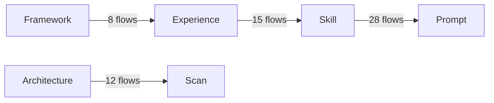

# Workflow Introspection System

工作流内省系统为 WorkFlowAgent 的 7 个核心模块（Skill、Prompt、Experience、Framework、Architecture、Scan）提供统一的活动跟踪、数据流分析和一致性验证能力。

## 架构概述

```
┌─────────────────────────────────────────────────────────────────────────────┐
│                         WORKFLOW INTROSPECTION SYSTEM                        │
├─────────────────────────────────────────────────────────────────────────────┤
│                                                                              │
│  ┌─────────────────────┐  ┌─────────────────────┐  ┌─────────────────────┐  │
│  │   Collector         │  │   Validator         │  │   Report Generator  │  │
│  │   - 事件收集        │  │   - 一致性检查      │  │   - JSON/Markdown   │  │
│  │   - 内存存储        │  │   - 交叉验证        │  │   - Mermaid图表     │  │
│  │   - 数据流追踪      │  │   - 风险识别        │  │   - 健康检查报告    │  │
│  └─────────────────────┘  └─────────────────────┘  └─────────────────────┘  │
│           ▲                        ▲                        ▲               │
│           │                        │                        │               │
│  ┌────────┴────────────────────────┴────────────────────────┴─────────────┐ │
│  │                         Introspection Manager                            │ │
│  │                    - 统一入口，简化API调用                               │ │
│  │                    - 自动Hook订阅                                        │ │
│  │                    - 生命周期管理                                        │ │
│  └─────────────────────────────────────────────────────────────────────────┘ │
└─────────────────────────────────────────────────────────────────────────────┘
```

## 核心模块

### 1. WorkflowIntrospectionCollector

负责收集 7 个核心模块的事件日志。

```javascript
const { introspectionCollector } = require('./workflow-introspection-collector');

// 初始化
introspectionCollector.initialize({
  sessionId: 'my-session-id',
  outputDir: './output',
  enabled: true,
});

// 记录事件
introspectionCollector.recordSkill('registered', {
  skillName: 'go_api',
  version: '1.0.0',
});

introspectionCollector.recordPrompt('injected', {
  skillName: 'go_api',
  agentRole: 'Developer',
});

introspectionCollector.recordExperience('registered', {
  experienceId: 'exp-001',
  type: 'negative',
  category: 'go_concurrency',
  sourceFile: 'api/router.go',
});
```

支持的事件类型：
- `registered` / `evolved` / `retired` - 生命周期事件
- `injected` / `used` / `queried` / `matched` - 使用事件
- `analyzed` / `scanned` / `reviewed` / `checked` - 分析事件
- `produced` / `consumed` / `transformed` - 数据流事件
- `passed` / `failed` / `fixed` / `ignored` - 结果事件

支持的模块类型：
- `Skill` - Skill管理系统
- `Prompt` - Prompt构建系统
- `Experience` - 经验存储系统
- `Framework` - CodeGraph框架
- `Architecture` - 架构评审系统
- `Scan` - 深度审计系统

### 2. ConsistencyValidator

验证 7 个模块之间的数据一致性。

```javascript
const { ConsistencyValidator } = require('./consistency-validator');
const { introspectionCollector } = require('./workflow-introspection-collector');

const validator = new ConsistencyValidator(introspectionCollector);
const report = validator.validateAll();

// 报告结构
{
  timestamp: "2026-03-25T...",
  summary: {
    totalIssues: 5,
    errors: 1,
    warnings: 3,
    infos: 1,
    passRate: 80,
  },
  byCategory: { /* 按类别分组的问题 */ },
  byModule: { /* 按模块分组的问题 */ },
  issues: [ /* 详细问题列表 */ ],
}
```

验证规则：

| 验证类别 | 说明 |
|---------|------|
| Skill-Prompt Consistency | 注入的 Skill 必须已注册，版本需匹配 |
| Experience-Skill Consistency | Skill 演化需追溯到来源经验 |
| Architecture-Scan Consistency | 架构评审发现的问题应被扫描捕获 |
| Framework-Experience Consistency | CodeGraph 应覆盖经验引用的文件 |
| Data Flow Consistency | 所有生产的实体应被消费 |
| Version Consistency | Skill 版本不应倒退 |

### 3. IntrospectionReportGenerator

生成人类可读和机器可读的报告。

```javascript
const { IntrospectionReportGenerator } = require('./introspection-report-generator');

const generator = new IntrospectionReportGenerator(collector, validator);
const { jsonPath, markdownPath } = generator.generateBoth('./output');
```

报告内容：
- 执行摘要（时间、模块数量、日志条目数）
- 各模块详细日志（按时间线）
- 一致性检查结果（通过/警告/失败）
- 数据流验证图（Mermaid 格式）
- 发现的不一致问题列表
- 建议的修复措施

### 4. IntrospectionManager（推荐使用）

统一入口模块，简化使用方式。

```javascript
const { introspectionManager } = require('./introspection-manager');

// 1. 初始化
introspectionManager.initialize({
  sessionId: 'my-session',
  outputDir: './output',
  enabled: true,
  autoGenerateReports: true,
});

// 2. 订阅Workflow Hooks（自动跟踪Stage）
introspectionManager.hookSubscribe(orchestrator.hooks);

// 3. 记录事件
introspectionManager.collector.recordSkill('registered', { ... });

// 4. 健康检查
const health = introspectionManager.healthCheck();
// {
//   healthy: true,
//   issues: { errors: 0, warnings: 0 },
//   moduleCoverage: "6/7",
//   suggestion: "All systems operating normally"
// }

// 5. 最终化
introspectionManager.finalize(); // 自动生成报告
```

## 集成指南

### 在 Orchestrator 中集成

1. **初始化**（在 `_initWorkflow` 中添加 Step 11）：

```javascript
const { introspectionManager } = require('./introspection-manager');
introspectionManager.initialize({
  sessionId: `${this.projectId || 'session'}-${Date.now()}`,
  outputDir: this._outputDir || PATHS.OUTPUT_DIR,
  enabled: true,
  autoGenerateReports: true,
});
this.introspectionManager = introspectionManager;

// 订阅Hooks
if (this.hooks) {
  introspectionManager.hookSubscribe(this.hooks);
}
```

2. **最终化**（在 `_finalizeWorkflow` 末尾添加）：

```javascript
if (this.introspectionManager) {
  const healthCheck = this.introspectionManager.healthCheck();
  if (!healthCheck.healthy) {
    console.warn(`⚠️ Introspection: ${healthCheck.suggestion}`);
  }
  this.introspectionManager.finalize();
}
```

### 在核心模块中添加日志

在现有模块中添加内省日志非常简单：

```javascript
const { introspectionCollector } = require('./workflow-introspection-collector');

// 在某个关键操作后
function doSomething() {
  // ... 业务逻辑 ...
  
  introspectionCollector.recordSkill('registered', {
    skillName,
    version,
    type,
  });
}
```

已经集成的模块：
- ✅ `experience-store.js` - 经验记录事件
- ✅ `prompt-builder.js` - Skill 注入事件
- ✅ `skill-evolution.js` - Skill 注册和演化事件

## 报告示例

### Markdown 报告预览

```markdown
# Workflow Introspection Report

> **Session:** session-1234567890
> **Generated:** 3/25/2026, 3:36:36 PM
> **Status:** ✅ All Clear (Pass Rate: 100%)

## Executive Summary

| Metric | Value |
|--------|-------|
| Total Introspection Entries | 156 |
| Unique Traces | 42 |
| Modules Covered | 7/7 |
| Validation Issues | 0 |
| Pass Rate | 100% |

## Validation Results

✅ **All validation checks passed!** No inconsistencies detected between modules.

## Cross-Module Data Flow



## Recommendations

✅ **No action required.** All modules are operating consistently.
```

## 配置选项

### 环境变量

```bash
# 启用/停用内省系统
WF_INTROSPECTION_ENABLED=true

# 输出目录
WF_INTROSPECTION_OUTPUT_DIR=./output

# 自动生成报告
WF_INTROSPECTION_AUTO_REPORT=true

# 验证类别（逗号分隔）
WF_INTROSPECTION_VALIDATION_CATEGORIES=skill-prompt,experience-skill,architecture-scan
```

### 代码配置

```javascript
introspectionManager.initialize({
  // 基础配置
  sessionId: 'unique-session-id',
  outputDir: './output',
  enabled: true,
  
  // 行为配置
  autoGenerateReports: true,
  
  // 验证配置
  validationCategories: [
    'skill-prompt',
    'experience-skill',
    'architecture-scan',
    'framework-experience',
    'data-flow',
    'version',
  ],
});
```

## 最佳实践

1. **在所有关键模块添加日志**：确保核心业务操作都有对应的内省日志。

2. **使用 Trace ID 追踪数据流**：跨模块传递的数据应使用相同的 trace ID。

```javascript
const traceId = generateTraceId();
introspectionCollector.recordSkill('produced', { entityId: 'skill-1' }, { traceId });
introspectionCollector.recordPrompt('consumed', { entityId: 'skill-1' }, { traceId });
```

3. **定期审查报告**：将报告审查纳入工作流程，及早发现模块间的数据不一致。

4. **关注健康检查**：健康检查不通过时应及时处理，特别是 ERROR 级别的问题。

5. **避免在高频路径过度记录**：内省系统使用内存存储，避免在非常高频的操作中过度记录。

## 故障排查

### 问题：报告未生成
- 检查 `outputDir` 是否正确设置
- 检查磁盘空间
- 查看控制台是否有权限错误

### 问题：验证器报告大量问题
- 检查是否正确初始化了所有模块的日志
- 检查是否存在真正的业务逻辑问题
- 使用 `validateCategory()` 单独验证各模块

### 问题：性能影响
- 确保在高频操作中仅记录关键事件
- 考虑在 `initialize()` 中设置 `enabled: false` 临时关闭

## 相关文件

- `workflow/core/workflow-introspection-collector.js` - 收集器实现
- `workflow/core/consistency-validator.js` - 验证器实现
- `workflow/core/introspection-report-generator.js` - 报告生成器
- `workflow/core/introspection-manager.js` - 统一管理器
- `workflow/core/workflow-introspection.test.js` - 测试文件

## 贡献

如需添加新的验证规则或扩展模块支持，请参考：

1. 在 `ModuleType` 和 `ActionCategory` 中添加新的类型（如需要）
2. 在 `ConsistencyValidator` 中添加新的验证方法
3. 在 `IntrospectionReportGenerator` 中添加对应的报告内容
4. 更新本文档