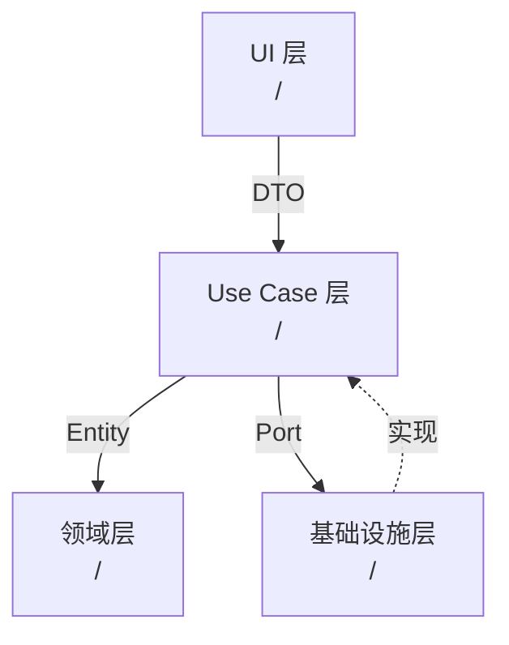
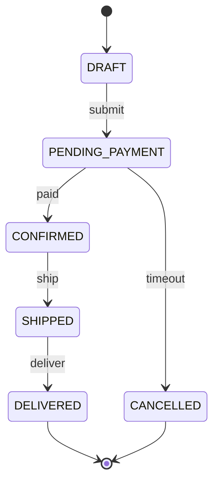

# 维度实例对照 (Examples)

> 本文件是 `skill-author-guide.md` 的附属资料。
> 作用：让你**对照 ❌坏例和 ✅好例**，看清楚"空话"和"带证据"的差距。
>
> **使用方式**（写给 IDE Agent）：
> 1. 写完某一节后，read_file 本文件对应小节
> 2. 用好例的"证据密度"作为自己的参照标准
> 3. 如果自己的产出接近坏例 —— 回去重写
>
> **设计原则**（决策已锁定）：
> - 只有两档：❌ 坏例 + ✅ 好例，**没有中庸例**（中庸例会让对比失焦）
> - 所有示例使用 `<ProjectName>` / `<ModuleA>` 等占位符，**完全脱敏不绑定具体项目**

## 目录

1. [§1 项目概览](#1-项目概览)
2. [§2 项目流程与生命周期](#2-项目流程与生命周期)
3. [§3 模块管理](#3-模块管理)
4. [§4 设计模式](#4-设计模式)
5. [§5 架构框架](#5-架构框架)
6. [§6 事件系统](#6-事件系统)
7. [§7 状态管理](#7-状态管理)
8. [§8 配置与数据驱动](#8-配置与数据驱动)
9. [§9 持久化与存档](#9-持久化与存档)
10. [§10 网络通信](#10-网络通信)
11. [§11 日志系统](#11-日志系统)
12. [§12 公共组件与工具库](#12-公共组件与工具库)
13. [§M-1 错误处理](#m-1-错误处理)
14. [§M-2 修改影响半径](#m-2-修改影响半径)
15. [§M-3 Onboarding 路径](#m-3-onboarding-路径)

---

## §1 项目概览

### ❌ 坏例
```markdown
## 1. 项目概览

本项目是一个软件项目，使用主流技术栈开发。代码组织良好，有清晰的分层结构。
```

### ✅ 好例
```markdown
## 1. 项目概览

| 属性 | 值 |
|---|---|
| 项目类型 | <ProjectType>（<示例：kart 赛车游戏>） |
| 主语言 | <Language>，占比 <X>%（<Y> 个源文件） |
| 运行时 | <Runtime + version>（如 "某游戏引擎 某版本 LTS" / "Node.js 20" / "JVM 17"）|
| 规模 | <N> 符号，<M> 文件，估算 <K>K LOC |
| 主要模式 | Observer / Command / Pipeline（详见 §4） |
| 核心数据流 | `<EntryFile>` → `<CoreModuleA>` → `<CoreModuleB>` |

**顶层目录结构**：
```
<root>/
├── <ModuleA>/      — 核心业务逻辑（<N> 文件）
├── <ModuleB>/      — 轻量版核心（移动端/性能优化变体，<M> 文件）
├── <UtilsDir>/     — 公共工具（<K> 文件，reusableSymbols Top-5 都在这里）
└── <TestDir>/      — 集成测试
```

**关键洞察**：`<ModuleA>/` 和 `<ModuleB>/` 存在平行实现。查找符号时必须两边都看。
```

**为什么好例好**：给了 6 个真实数字 + 具体模块职责 + 1 条关键洞察。坏例是任何项目套用都成立的废话。

---

## §2 项目流程与生命周期

### ❌ 坏例
```markdown
## 2. 项目流程

项目有入口函数，启动后执行主逻辑，最后结束。请参考相关文档了解更多。
```

### ✅ 好例
```markdown
## 2. 项目流程与生命周期

### 启动序列（调用链）
1. `<EntryFile.ext>:<line>` `<main()>` → 解析命令行参数
2. `<CoreModule>/<Bootstrap.ext>:<line>` `<initServices()>` → 注册核心服务
3. `<CoreModule>/<EventBus.ext>:<line>` `<EventBus.init()>` → 启动事件总线
4. `<CoreModule>/<MainLoop.ext>:<line>` `<run()>` → 进入主循环（见下）

### 主循环（单帧/单请求处理）
```<lang>
// <File.ext>:<line>
while (running) {
  const tick = now();
  eventBus.flush();       // 消费上一帧累积的事件
  updateSystems(tick);    // 按优先级更新各 System
  render(tick);           // 可选：仅 UI 项目
  yield nextFrame();
}
```

### 关闭流程
- 信号：`SIGINT` 或 `<StopEvent>` 事件
- 顺序：停主循环 → flush 事件队列 → 关网络连接 → 落盘未保存状态 → 释放资源

### 如何扩展"启动流程"
添加新初始化步骤：
1. 在 `<CoreModule>/<Bootstrap.ext>` 的 `initServices()` 里新增一行
2. 遵循依赖顺序：网络 < 存储 < 事件 < 业务 < UI
3. 新增的服务必须实现 `<IService>` 接口（定义在 `<ServicesDir>/<IService.ext>`）
4. 如果服务有关闭逻辑，在 `shutdown()` 序列里对称注册
```

**为什么好例好**：给了 4 步启动链 + 真实代码片段 + 关闭顺序 + "如何扩展"步骤。坏例几乎等于没写。

---

## §3 模块管理

### ❌ 坏例
```markdown
## 3. 模块管理

项目分为多个模块，每个模块负责不同的职责。模块之间通过接口通信。
```

### ✅ 好例
```markdown
## 3. 模块管理

### 模块清单（按体量排序）

| 模块 | 文件数 | 职责 | 依赖 |
|---|---|---|---|
| `<ModuleCore>` | <N1> | 核心业务引擎 | `<ModuleUtils>`、`<ModuleEvent>` |
| `<ModuleAPI>` | <N2> | REST 接口层 | `<ModuleCore>`、`<ModuleAuth>` |
| `<ModuleAuth>` | <N3> | 鉴权和会话 | `<ModuleUtils>` |
| `<ModuleUtils>` | <N4> | 纯工具库，零依赖 | — |

### 跨模块 Top-5 调用边（来自 callEdges 聚合）

| 调用方 | 被调用方 | callCount |
|---|---|---|
| `<ModuleAPI>` | `<ModuleCore>` | <X1> |
| `<ModuleCore>` | `<ModuleEvent>` | <X2> |
| `<ModuleCore>` | `<ModuleUtils>` | <X3> |

### 模块加载方式
自动扫描 `<root>/<modulesDir>/` 下所有 `index.<ext>`，调用 `registerModule()` 注入全局 Registry（见 `<ModuleRegistry.ext>:<line>`）。

### 如何新增一个模块
1. `mkdir <modulesDir>/<newModule>`
2. 创建 `index.<ext>` 并 export `registerModule(registry)` 函数
3. 在 `registerModule` 里调用 `registry.register(name, factory)`
4. 新模块的单测放在 `<testsDir>/<newModule>/`
5. 若需要被其他模块依赖，避免循环依赖（可用 `<ModuleUtils>` 这种零依赖模块作为共享层）
```

**为什么好例好**：给了量化清单 + 真实 callCount + 加载机制 + 扩展步骤。坏例没有任何项目特有信息。

---

## §4 设计模式

### ❌ 坏例
```markdown
## 4. 设计模式

项目使用了 Observer、Factory、Singleton 等经典设计模式。这些模式提高了代码的可维护性。
```

### ✅ 好例
```markdown
## 4. 设计模式

### 4.1 Observer（事件总线）
- **位置**：`<CoreModule>/<EventBus.ext>:<line>`（主实现，被 <N> 处调用）、`<CoreModule>/<Event.ext>`（事件基类）
- **为什么选它**：跨模块通信去中心化，`<ModuleA>` 和 `<ModuleB>` 都订阅 `<DomainChangedEvent>` 而互不知道
- **真实用例**：
```<lang>
// <CoreModule>/<EventBus.ext>:<line>
class EventBus {
  on(event, handler) { /* ... */ }
  emit(event, payload) { /* ... */ }
}

// 典型使用
eventBus.on('<UserLoggedIn>', (user) => auditLog.record(user));
eventBus.emit('<UserLoggedIn>', currentUser);
```
- **约定**：事件名必须在 `<CoreModule>/<EventTypes.ext>` 常量文件声明，禁止字面量
- **坑**：`.on()` 回调里不要再次 `.emit()` 同类事件（会引发循环触发）

### 4.2 Pipeline（阶段处理）
- **位置**：`<ModuleCore>/<Pipeline.ext>:<line>`（基类），具体实现 <M> 个
- **为什么选它**：业务处理按阶段演进（parse → validate → execute → report），每个阶段独立可替换
- **真实用例**：
```<lang>
const pipeline = new Pipeline([parseStage, validateStage, executeStage]);
const result = await pipeline.run(input);
```
- **约定**：每个 Stage 必须是纯函数或返回 Promise；失败靠 throw 向上冒泡
- **坑**：Stage 顺序改变会破坏数据契约，修改时必须跑 §5 的端到端集成测试

### 4.3 Registry（插件注册）
...（略）
```

**为什么好例好**：每个模式都给了"在哪、为什么、怎么用、约定、坑"5 要素 + 真实代码。坏例只是罗列模式名称。

---

## §5 架构框架

### ❌ 坏例
```markdown
## 5. 架构

采用分层架构，遵循单一职责原则。
```

### ✅ 好例
```markdown
## 5. 架构框架

### 架构风格：Clean Architecture（变体）



### 各层职责

| 层 | 位置 | 职责 | 禁止 |
|---|---|---|---|
| UI | `<UIDir>/` | 展示 + 用户交互 | 禁止直接访问 DB/网络 |
| Use Case | `<UseCasesDir>/` | 业务流程编排 | 禁止 import UI 代码 |
| 领域 | `<DomainDir>/` | 实体 + 业务规则 | 禁止 import 任何外层 |
| 基础设施 | `<InfraDir>/` | DB/网络/文件系统实现 | 实现 Use Case 定义的 Port 接口 |

### 跨层数据契约
- UI ↔ Use Case：DTO（定义在 `<DTOsDir>/`）
- Use Case ↔ 领域：Entity（领域层原生类型）
- Use Case ↔ 基础设施：Port 接口（定义在 `<PortsDir>/`，基础设施实现）

### 如何添加一个新功能（按层切片）
1. 在 `<DomainDir>/` 定义新 Entity（若需要）
2. 在 `<PortsDir>/` 声明新 Port 接口（若需外部依赖）
3. 在 `<UseCasesDir>/` 实现新 Use Case
4. 在 `<InfraDir>/` 实现 Port（DB/HTTP 调用）
5. 在 `<UIDir>/` 添加入口
6. 顺序不能反！否则会出现"UI 先依赖未存在的 Use Case"
```

**为什么好例好**：给了 mermaid 图 + 明确禁止项 + DTO/Entity/Port 约定 + step-by-step 扩展步骤。

---

## §6 事件系统

### ❌ 坏例
```markdown
## 6. 事件系统

项目使用事件驱动架构，模块之间通过事件解耦。
```

### ✅ 好例
```markdown
## 6. 事件系统

### 事件总线实现
- **文件**：`<CoreModule>/<EventBus.ext>:<line>`
- **类型**：全局单例（`getInstance()` 访问）
- **API**：
```<lang>
eventBus.on(eventName, handler);      // 注册
eventBus.off(eventName, handler);     // 取消（**handler 引用必须一致**）
eventBus.emit(eventName, ...payload); // 同步触发
eventBus.emitAsync(eventName, ...);   // 异步队列
```

### 事件命名约定
- 定义在 `<CoreModule>/<EventTypes.ext>` 作为字符串常量
- 格式：`<领域>:<动词过去式>`，如 `user:loggedIn`、`order:confirmed`
- **禁止字面量**：`emit('userLoggedIn')` 会被 lint 拒绝

### 核心事件清单

| 事件名 | 触发时机 | 典型订阅方 | payload |
|---|---|---|---|
| `<user:loggedIn>` | 用户登录成功 | 审计/欢迎通知 | `{userId, deviceId}` |
| `<order:confirmed>` | 订单确认 | 库存扣减/发票/push | `{orderId, amount}` |
| `<error:unrecoverable>` | 系统级无法恢复错误 | 崩溃报告/用户提示 | `{error, stack}` |
| `<config:reloaded>` | 配置热更新后 | 各 Service 重新读配置 | `{changedKeys}` |
| `<shutdown:started>` | 开始关闭流程 | 所有需要 flush 的服务 | `{reason}` |

### 典型事件链
```
用户点击下单
  → emit('order:created')
    → PaymentService 订阅：发起扣款
      → emit('payment:success')
        → OrderService 订阅：状态转换为已确认
          → emit('order:confirmed')
            → NotificationService 订阅：发 push + 邮件
            → AuditService 订阅：落盘
```

### 如何添加新事件
1. 在 `<EventTypes.ext>` 新增常量：`export const NEW_EVENT = 'domain:verbPast'`
2. 在触发方调用 `eventBus.emit(NEW_EVENT, payload)`
3. 在订阅方 `eventBus.on(NEW_EVENT, handler)` 并确保在 `destroy()` 里 `off`
4. 在测试里验证"事件触发了 vs 订阅方调用了"
5. **勿在高频循环里 emit**（见坑 1）

### 常见坑
1. **重复订阅**：每次页面进入都 `on()` 但从不 `off()` → 内存泄漏 + 回调多次执行。规避：在组件/服务的 `destroy()` 里对称 `off()`
2. **循环触发**：A 事件的 handler 里 `emit` A 事件 → 无限递归。规避：`handler` 内禁止触发同名事件
3. **异步序列错误**：`emitAsync` 触发的事件序列不保证与 `emit` 按时序交织，依赖顺序的逻辑要用 `await`
```

**为什么好例好**：给了 5 要素 API + 命名约定 + 5 个真实事件 + 典型链 + 扩展步骤 + 3 个坑。

---

## §7 状态管理

### ❌ 坏例
```markdown
## 7. 状态管理

项目使用全局状态管理，确保各组件之间的数据同步。
```

### ✅ 好例
```markdown
## 7. 状态管理

### 状态分类（本项目 4 类）

| 类别 | 存放位置 | 生命周期 | 变更方式 |
|---|---|---|---|
| 全局会话 | `<StoresDir>/<SessionStore.ext>` | 应用启动到退出 | `dispatch(action)` |
| 业务领域 | 各 Entity 内部 | 领域对象生命周期 | 调用 Entity 方法 |
| UI 组件 | 组件本地 state | 组件挂载到卸载 | `setState` |
| 缓存层 | `<CacheDir>/<Cache.ext>` | LRU 策略 | 不可直接修改 |

### 核心状态机：`<OrderStateMachine>`
- **文件**：`<DomainDir>/<OrderStateMachine.ext>:<line>`
- **状态列表**：`DRAFT` → `PENDING_PAYMENT` → `CONFIRMED` → `SHIPPED` → `DELIVERED` / `CANCELLED`



### 状态变更约定
- 全局状态只能通过 `dispatch(action)` 修改，禁止直接赋值
- Action 类型定义在 `<ActionsDir>/<types.ext>`
- Reducer 必须纯函数，禁止副作用

### 如何添加新状态字段
1. 在 `<StoresDir>/<XxxStore.ext>` 的 `initialState` 新增字段（带默认值）
2. 在 `<ActionsDir>/<types.ext>` 新增 Action 常量
3. 在 reducer 里处理该 Action
4. 在使用方 `useStore(s => s.newField)` 读取

### 常见坑
1. **状态漂移**：某个组件本地 state 和全局 state 都存同一份数据 → 不同步。规避：单一真相源，选一处
2. **状态机跳跃**：绕过状态机直接改 `order.status = 'CONFIRMED'` → 跳过业务规则。规避：`status` 字段 private，只通过方法改
3. **忘记重置**：登出后 session 还留在内存 → 下次登录看到上次数据。规避：在 `<ShutdownEvent>` 处统一 reset
```

**为什么好例好**：分类清晰 + 状态机图 + 变更约定 + 扩展步骤 + 3 个具体坑。

---

## §8 配置与数据驱动

### ❌ 坏例
```markdown
## 8. 配置

配置文件位于 config/ 目录，根据环境加载不同的配置。
```

### ✅ 好例
```markdown
## 8. 配置与数据驱动

### 配置文件位置

| 文件 | 作用 | 加载时机 |
|---|---|---|
| `<configDir>/default.<ext>` | 所有环境默认值 | 启动时 |
| `<configDir>/<env>.<ext>`（dev/staging/prod） | 环境差异覆盖 | 启动时，按 `NODE_ENV` 选择 |
| `<configDir>/local.<ext>` | 开发者本地覆盖，`.gitignore` | 启动时，如存在 |
| 环境变量 `<APP_>*` | 运行时动态注入 | 启动时读，支持 SIGHUP 热加载 |

### 配置加载器
- **文件**：`<CoreModule>/<ConfigLoader.ext>:<line>`
- **加载顺序**：default → env-specific → local → ENV（后者覆盖前者）
- **典型代码**：
```<lang>
const config = new ConfigLoader()
  .loadFile('default.<ext>')
  .mergeFile(`${process.env.NODE_ENV || 'dev'}.<ext>`)
  .mergeEnv('<APP_>')
  .build();
```

### 项目常量
- 物理常量（不会变的）：`<ConstantsDir>/<Physical.ext>`
- 业务配置（可能调整的）：配置文件
- **判断标准**：会不会因环境/客户/灰度变化 → 会 → 配置；不会 → 常量

### 如何添加新配置项
1. 在 `<configDir>/default.<ext>` 增加 key + 默认值
2. 如需环境差异，在对应 `<env>.<ext>` 里覆盖
3. 在 `<CoreModule>/<ConfigSchema.ext>` 更新 schema（运行时校验）
4. 使用方 `config.get('newKey')` 或 `config.getOrThrow('newKey')`
5. 写一条文档记录该配置的影响范围

### 常见坑
1. **默认值遗漏**：新配置未给 default 值 → prod 环境报 undefined。规避：schema 校验启动时兜底
2. **热更新遗漏**：新配置加了，但 `<configReloadHandler>` 没处理该 key → 热更无效
3. **类型错配**：ENV 变量永远是字符串，`'false'` 不等于 `false`。规避：显式 parse（`Boolean('false')` ≠ false）
```

**为什么好例好**：列清了加载顺序 + 常量 vs 配置决策规则 + 扩展步骤 + 3 个具体坑。

---

## §9 持久化与存档

### ❌ 坏例
```markdown
## 9. 持久化

数据保存到本地存储，支持读取和写入。
```

### ✅ 好例
```markdown
## 9. 持久化与存档

### 存储什么
- 玩家进度（关卡、装备） → `<saveDir>/player.<ext>`
- 配置偏好（音量、语言） → `<saveDir>/settings.<ext>`
- 缓存数据（不重要） → `<cacheDir>/`（启动时可清）

### 序列化格式
- **玩家进度**：自定义二进制（含版本头），见 `<CoreModule>/<SaveFormat.ext>:<line>`
- **配置偏好**：JSON
- **为什么不统一 JSON**：进度文件较大且需校验完整性，二进制 + CRC 比 JSON 快 3 倍

### 版本兼容策略
- 存档头固定 16 字节：`<MAGIC>(4) | <VERSION>(4) | <CRC>(4) | <SIZE>(4)`
- 读取流程：
  1. 校验 MAGIC → 非本项目存档直接报错
  2. 读 VERSION → 若 `< currentVersion`，走 migration 链（`<MigrationsDir>/<v1_to_v2>.<ext>` 等）
  3. 校验 CRC → 不匹配视为损坏，加载备份副本
- 每次存档结构变化 → `VERSION++` 并新增一个 migration 文件

### 如何加一个存档字段
1. 在 `<CoreModule>/<SaveData.ext>` 加字段（带默认值，应对老存档）
2. 版本号 +1，在 `<SaveFormat.ext>` 更新 `CURRENT_VERSION`
3. 新增 `<MigrationsDir>/<vN_to_vN+1>.<ext>`：把老版本数据映射到新格式
4. 写一条迁移测试
5. 不要删除旧 migration（老玩家升级需要链式迁移）

### 常见坑
1. **存档损坏**：进程崩溃时写入未完成。规避：write-to-temp + rename atomic + 双存档轮换
2. **版本回退**：玩家回退到老版本看到新字段 → 直接崩溃。规避：老版本遇到未知字段选择忽略而不是报错
3. **CRC 失效**：忘记加 CRC 导致静默损坏。规避：启动时强校验，失败立即报警
```

**为什么好例好**：说清格式选择原因 + 版本策略 + 扩展步骤 + 3 个具体坑。

---

## §10 网络通信

### ❌ 坏例
```markdown
## 10. 网络

使用 HTTP 与服务端通信，包含常规的 CRUD 接口。
```

### ✅ 好例
```markdown
## 10. 网络通信

### 协议栈
- **业务 API**：HTTPS REST（`<ApiClientDir>/<RestClient.ext>`）
- **实时消息**：WebSocket（`<ApiClientDir>/<WsClient.ext>`，含自动重连）
- **大文件**：HTTP Range（`<ApiClientDir>/<ChunkedDownloader.ext>`）

### REST 客户端封装
- **文件**：`<ApiClientDir>/<ApiClient.ext>:<line>`
- **核心能力**：
  - 统一添加 `Authorization: Bearer <token>` header
  - 5xx 自动重试（指数退避，最多 3 次）
  - 401 自动刷新 token 并重放请求
  - 请求/响应日志脱敏（参见 §11）
- **典型调用**：
```<lang>
const result = await apiClient.get('/users/me');
const user = await apiClient.post('/users', { name, email });
```

### WebSocket 重连策略
- 心跳间隔：30s
- 断线后指数退避：1s → 2s → 4s → … → 最大 60s
- 超过 5 次失败 → 触发 `<network:offline>` 事件（见 §6）

### 错误哲学（与 §M-1 一致）
- 网络错误统一转为 `<NetworkError>` 子类（`<ErrorsDir>/<NetworkErrors.ext>`）
- 由顶层 UI 统一处理（吐司/离线提示），业务代码只 `try/catch` `NetworkError`

### 如何添加新 API
1. 在 `<ApiSpecDir>/<xxx.yaml>` 里定义 OpenAPI schema
2. 运行 `<generate-api>` 命令生成 client stub
3. 在业务层 import stub 使用，勿手写 fetch
4. 为新 API 写一个 MSW mock（测试用）

### 常见坑
1. **重连风暴**：多个客户端同时重连 → 服务端雪崩。规避：指数退避 + 抖动（±30% 随机）
2. **token 过期未感知**：401 返回但未触发刷新 → 后续请求都 401。规避：拦截器统一处理
3. **大响应阻塞**：下载大文件未用 stream → 内存爆。规避：强制走 ChunkedDownloader
```

**为什么好例好**：给了协议分层 + 封装能力清单 + 扩展步骤 + 3 个具体坑。

---

## §11 日志系统

### ❌ 坏例
```markdown
## 11. 日志

使用日志记录运行时信息，支持不同级别。
```

### ✅ 好例
```markdown
## 11. 日志系统

### 日志库
- **库名**：`<logger-lib>`（v<x.y.z>）
- **主入口**：`<UtilsDir>/<Logger.ext>:<line>`
- **调用方式**：`const logger = getLogger('<module-name>')`

### 日志等级与使用规范

| 等级 | 何时使用 | 线上采样率 |
|---|---|---|
| `error` | 不可恢复的错误，需人工介入 | 100% |
| `warn` | 业务异常，但已通过兜底处理 | 100% |
| `info` | 关键业务节点（登录、下单、支付完成） | 100% |
| `debug` | 调试细节，请求入参响应 | 开发环境 100%，线上 1% |
| `trace` | 极度详细，如循环内日志 | 仅开发环境 |

### 日志格式
- 生产：结构化 JSON，固定字段 `{ts, level, module, msg, traceId, userId}` + 自定义字段
- 开发：人类可读彩色

### 敏感字段脱敏
- 定义在 `<UtilsDir>/<LogRedactor.ext>`：密码 / token / 身份证 / 手机号自动脱敏
- 新增敏感字段：在 `REDACT_KEYS` 常量增加

### 典型用法
```<lang>
logger.info('user.login', { userId, device });  // ✅ 带结构化字段
logger.info(`User ${userId} logged in from ${device}`);  // ❌ 拼字符串，无法结构化查询
```

### 常见坑
1. **循环内 info**：`for (item of 10000items) logger.info(...)` → 日志爆炸。规避：改 trace 级别 + 批量汇总
2. **忘记 traceId**：跨服务请求无法串联。规避：中间件统一注入
3. **敏感信息漏脱敏**：新加字段忘了加入 `REDACT_KEYS`。规避：code review 硬性检查
```

**为什么好例好**：等级规范 + 格式 + 脱敏 + 正反例 + 3 个坑。

---

## §12 公共组件与工具库

### ❌ 坏例
```markdown
## 12. 工具库

项目提供了一些通用工具函数，位于 utils 目录下，可以方便地复用。
```

### ✅ 好例
```markdown
## 12. 公共组件与工具库

### Top-10 高频复用符号（来自 code-graph.reusableSymbols）

#### `<deepClone(obj)>`
- **位置**：`<UtilsDir>/<object.ext>:<line>`
- **Signature**：`function deepClone<T>(obj: T): T`
- **用途**：深拷贝任意对象，处理循环引用
- **refs**：<X> 次（Top-1）
- **示例**：
```<lang>
import { deepClone } from '<UtilsDir>/object';
const snapshot = deepClone(state);  // 避免后续修改污染原对象
```
- **注意**：对 Date/RegExp/Map/Set 做了专门处理；不处理 DOM 节点；性能不及 `JSON.parse(JSON.stringify(x))`，但正确性更好

#### `<EventBus>`（单例）
- **位置**：`<CoreModule>/<EventBus.ext>:<line>`
- **Signature**：`class EventBus { on(e, cb), off(e, cb), emit(e, ...args) }`
- **用途**：全局事件总线（见 §6）
- **refs**：<Y> 次
- **示例**：（参见 §6.3）

#### `<Result<T, E>>`
- **位置**：`<UtilsDir>/<result.ext>:<line>`
- **Signature**：`type Result<T, E> = { ok: true, value: T } | { ok: false, error: E }`
- **用途**：函数式错误传递（替代 try/catch）
- **refs**：<Z> 次
- **示例**：
```<lang>
function parse(input: string): Result<Parsed, ParseError> {
  if (!valid(input)) return { ok: false, error: new ParseError() };
  return { ok: true, value: doParse(input) };
}
```
- **约定**：新写业务逻辑优先用 Result，避免 throw；跨层边界（UI/API）可以转 throw

（继续列出另外 7 个...）

### 设计哲学
- **纯函数优先**：除了 Singleton 服务（EventBus / Logger / Cache），工具库几乎都是无状态纯函数
- **零依赖**：`<UtilsDir>/` 禁止 import `<CoreModule>` 或业务层，保证可被任何层复用

### 工具 vs 业务代码判断规则
- 若该逻辑出现在 ≥ 3 个不同业务模块 → 抽工具
- 若逻辑强耦合某个领域对象的内部状态 → 放领域层，不是工具
- 若是"本项目约定的工具方法"（如 Result） → 放 utils
- 若是"第三方库的薄封装" → 放 `<AdaptersDir>/`（不是 utils）
```

**为什么好例好**：每个工具都有 5 要素（位置/签名/用途/refs数字/示例）+ 设计哲学 + 判断规则。

---

## §M-1 错误处理

### ❌ 坏例
```markdown
## 错误处理

项目使用 try/catch 处理错误，确保程序稳定。
```

### ✅ 好例
```markdown
## 错误处理与容错策略

### 错误哲学：混合模式
- **边界外**（UI/API/外部调用）→ throw
- **业务逻辑内部**（领域层）→ 返回 `Result<T, E>`（见 §12）
- **非致命警告**（如重试）→ logger.warn + 继续

### 自定义错误类（Top-5）
| 错误类 | 文件 | 何时抛 | 恢复策略 |
|---|---|---|---|
| `<DomainError>` | `<ErrorsDir>/<DomainError.ext>` | 业务规则违反 | UI 友好提示 |
| `<NetworkError>` | `<ErrorsDir>/<NetworkError.ext>` | 网络不可达 | 重试或走离线模式 |
| `<AuthError>` | `<ErrorsDir>/<AuthError.ext>` | token 无效 | 自动刷新或跳登录 |
| `<ValidationError>` | `<ErrorsDir>/<ValidationError.ext>` | 参数不合法 | 返回用户修正 |
| `<SystemError>` | `<ErrorsDir>/<SystemError.ext>` | 磁盘满/内存溢 | 崩溃报告 |

### 全局错误拦截
- **Node**：`process.on('uncaughtException', ...)` 在 `<EntryFile>:<line>`
- **浏览器**：`window.onerror` + `window.onunhandledrejection`
- **动作**：① 上报崩溃日志（含 stack）；② 友好弹窗；③ 安全退出

### 如何添加新错误类型
1. 在 `<ErrorsDir>/` 新建 `<NewError>.<ext>`，继承 `<BaseError>`
2. 在 `<ErrorsDir>/<index.ext>` export
3. 在全局拦截器加分支（如需特殊 UI 处理）

### 常见坑
1. **吞异常**：`try { ... } catch (e) {}` 空 catch 块。规避：至少 `logger.warn(e)`
2. **错误信息泄漏**：直接把 stack trace 发给用户。规避：生产环境脱敏
3. **Promise 无 catch**：`async` 函数被调用但不 await。规避：lint 规则 `no-floating-promises`
```

---

## §M-2 修改影响半径

### ❌ 坏例
```markdown
## 修改影响半径

修改核心模块可能影响其他模块，请谨慎修改并跑完整测试。
```

### ✅ 好例（主路径）
```markdown
## 修改影响半径速查表

_数据来源：`codeGraph.callEdges` 聚合（总 edges=<X>，属正常水平）_

| 修改的模块 | 必须检查的下游 | 典型影响点 | 风险 |
|---|---|---|---|
| `<CoreModule>` | `<ModuleAPI>` (<N1> calls) / `<ModuleUI>` (<N2>) / `<ModuleAuth>` (<N3>) | 业务行为变化 | **P0** |
| `<ModuleEvent>` | 几乎所有模块（事件消费方） | 事件语义变化 | **P0** |
| `<ModuleUtils>` | 所有模块 | 工具行为改变 | **P1** |
| `<ModuleAPI>` | `<ModuleUI>` | 仅响应层 | P2 |
| `<ModuleAuth>` | `<ModuleAPI>` | 鉴权流程 | **P1** |

### 最危险的 Top-3 高耦合模块
1. `<ModuleEvent>`：作为事件总线，变更影响所有订阅方，回归测试必跑 E2E
2. `<CoreModule>`：核心业务逻辑，被 <M> 处调用，需跑完整集成测试
3. `<ModuleUtils>`：虽然 P1 级，但 refs 最高，一个 bug 会放大

### 建议回归策略
- 改 `<ModuleEvent>` → 跑 `<e2e-events>` 测试集（15 min）
- 改 `<CoreModule>` → 跑 `<integration/core/*>`（10 min）
- 改 `<ModuleUtils>` → 跑单测 + 至少一次 smoke test
```

### ✅ 好例（降级路径，当 callEdges < 50）
```markdown
## 修改影响半径速查表

> ⚠️ 本章节基于目录结构推断，callEdges 数据不足（实际 <X> 条 < 50 阈值），
> 精确耦合关系请结合 IDE `find_references` 手工验证。

### 基于文件体量的粗估影响

| 修改的模块 | 体量 | 被依赖程度（定性） | 风险 |
|---|---|---|---|
| `<ModuleCore>` | <N1> 文件 | **高**（目录命名暗示核心） | **P0** |
| `<ModuleUtils>` | <N2> 文件 | **高**（工具层） | **P1** |
| `<ModuleApi>` | <N3> 文件 | 中 | **P1** |

### 手工验证建议
对关键变更，请先用 IDE `find_references` 对主要变更符号做全局搜索，若结果 > 20 处，按 §M-2 主路径流程谨慎评估。
```

**为什么好例好**：带真实数字（主路径）或显式降级声明（降级路径）。坏例就是空话。

---

## §M-3 Onboarding 路径

### ❌ 坏例
```markdown
## 新人指引

建议新同学先阅读 README 和 docs 目录，然后根据需要深入代码。
```

### ✅ 好例
```markdown
## 新人 Onboarding 路径

### Day 1（理解项目做什么）
1. **10 min**：读 `<root>/README.md`（了解项目目标）
2. **30 min**：读 `<EntryFile.ext>`（程序入口，全貌印象）
3. **30 min**：读 `<docs>/<architecture.md>`（如有），对照本 skill §5 架构框架
4. **作业**：画出你理解的"数据流图"（允许简陋），和 §5 mermaid 图对照

### Day 2-3（理解项目怎么运转）
5. **1h**：读 `<CoreModule>/<MainLoop.ext>`（主循环） + `<CoreModule>/<EventBus.ext>`（事件总线）
6. **1h**：读任一 Use Case 端到端：`<UseCasesDir>/<OrderUseCase.ext>`（从 UI 到 DB）
7. **30 min**：读 `<UtilsDir>/<Logger.ext>` + `<UtilsDir>/<object.ext>`（熟悉工具库风格）
8. **作业**：添加一行 `logger.debug(...)` 到主循环，本地跑一次看输出

### Week 1（具备修小 bug 能力）
9. 读 §12 列出的 Top-10 reusableSymbols 所在文件
10. 读 1 个测试文件（`<testsDir>/<xxx.spec.ext>`）掌握测试写法
11. **作业**：挑一个标 `good-first-issue` 的 PR 完成

### 3 个最易误解的点
1. **平行模块**：`<ModuleCore>` 和 `<ModuleLiteCore>` 不是新旧版本，是移动/桌面的变体 — 修改必须两边同步
2. **事件名不能字面量**：`eventBus.emit('xxx')` 会被 lint 拒绝，必须用 `<EventTypes.ext>` 的常量
3. **Result vs throw**：业务层严禁 `throw DomainError`，必须返回 `Result<T, E>`；边界层才能 throw
```

**为什么好例好**：按天切分 + 具体文件 + 每阶段配套作业 + 易误解陷阱。

---

---

## §13 MVC 数据流与绑定 [D3] ✨

### ❌ 坏例（空话）

```markdown
## MVC 数据流

本项目采用 MVC 架构，数据层和视图层解耦，视图会自动响应数据变化。
```

### ✅ 好例（带证据 + 通用化占位符）

```markdown
## MVC 数据流与绑定 [D3]

### 架构模式
本项目使用**响应式 Model-View 绑定系统**：
- **数据层入口**：`<FrameworkRoot>/<DataLayer>/<DataStore>.<ext>`（≥N KB）
  按类型 ID 存储数据到 `Dictionary<<TypeKey>, <DataContainer>>`
- **视图层基类**：`<FrameworkRoot>/<DataLayer>/<ViewBase>.<ext>`
  提供 `<LifecycleA>Binder`（如 mounted→destroyed）和 `<LifecycleB>Binder`（如 visible→hidden）两种绑定
- **监听机制**：`<FrameworkRoot>/<DataLayer>/<ChangeListener>.<ext>` 定义 N 种事件类型：
  Add / Update / Remove / Clear + 批量版本（`<ChangeEventEnum>` 枚举）

### 数据变更事件类型（枚举）
enum <ChangeEventEnum> 含：Add, Update, Remove, Clear + 批量版本 BatAdd/BatUpdate/BatRemove

### "数据改变 → 视图刷新"完整示例

1. **数据层写入**（业务层，callCount <高频次数> 次）：
   `var <domainStore> = <DataAccessor>.getModel<<DomainDataModel>>();`
   `<domainStore>.putData<<DomainItem>>(newItem);` → 触发 Add 事件
2. **视图层绑定**（UI 层继承 `<ViewBase>`）：在 `onStart` 里调 `aliveBinder.addModelBinding<<DomainItem>>(<domainStore>, this.onChanged)`
3. **视图刷新**：回调中调 `this.refreshCell(item)`

### 绑定生命周期规则
| 绑定器 | 生命周期 | 何时用 |
|---|---|---|
| `aliveBinder` | Start → Destroy | 持续存在的 UI，如主界面 |
| `activeBinder` | Enable → Disable | 临时弹窗、可切换面板 |

⚠️ **禁止**：初始化完成后再调用 `aliveBinder` 会抛异常（源码已断言）

### 反模式（新人易错）
1. ❌ **绕过数据层直接改 UI**：下次数据从服务器回来会覆盖
2. ❌ **忘记 Release 绑定**：holder 销毁时未解绑 → 内存泄漏
3. ❌ **在构造阶段调用 aliveBinder**：此时还没进入 Start 生命周期
```

**为什么好例好**：完整贯穿数据→事件→绑定→视图的链路 + 生命周期表 + 具体断言 + 新人陷阱。

### 📐 跨项目类型对照表（同一维度在不同项目里长什么样）

| 项目类型 | 数据层 | 视图绑定 | 事件机制 |
|---|---|---|---|
| 游戏（组件化引擎）| 自研 DataStore + 事件订阅 | View 基类 + lifecycle binder | 枚举 Add/Update/Remove/Clear |
| 前端 SPA（Vue 系）| Pinia/Vuex store + `storeToRefs` | watch/watchEffect + computed | reactive proxy trap |
| 前端 SPA（React 系）| Redux/Zustand store + selector | useSelector + useEffect | dispatch(action) |
| 桌面（MVVM 系）| INotifyPropertyChanged ViewModel | XAML Binding + DataContext | PropertyChanged event |
| 后端（MVC 渲染）| Entity + Repository + Service | 模板引擎渲染（无动态绑定）| N/A |

---

## §14 模块间通讯契约 [D3] ✨

### ❌ 坏例（模糊列举）

```markdown
## 模块间通讯

模块之间可以通过事件或直接调用来通讯，也可以用单例访问。
```

### ✅ 好例（带选型决策 + 通用化占位符）

```markdown
## 模块间通讯契约 [D3]

### 跨模块调用 Top-10（从 <N> 条 callEdges 聚合）
| 源模块 | 目标模块 | callCount | 主要通讯手段 |
|---|---|---|---|
| `<ModuleA/UILayer>` | `<ModuleB/BusinessLayer>` | <N> | Singleton.Instance 调用 |
| `<ModuleB/BusinessLayer>` | `<ModuleC/CoreLayer>` | <N> | 事件（`<TypedEvent>`）|
| `<ModuleA/UILayer>` | `<Framework>/EventBus` | <N> | 事件订阅 |
| `<ModuleC/CoreLayer>` | `<Framework>/Utility` | <N> | 直接调用（`<AssertUtil>`/`<Singleton>`）|
| `<ModuleB/NetSub>` | `<ModuleB/AuthSub>` | <N> | `<ServiceGateway>` 间接调用 |
| ... | ... | ... | ... |

### N 种通讯手段与代表文件

1. **直接调用**（`<Framework>/Utility/*` 被 8000+ 次调用）：无状态工具函数。例：`<AssertUtil>.isTrue(cond);` / `<StringUtil>.concat(...)`
2. **单例访问**（通过 `<SingletonTemplate><T>.Instance`）：全局状态（Manager/System 类）。例：`<UIManager>.Instance.openUI<<DomainView>>();`
3. **事件总线**（`<Framework>/Event/<TypedEvent><T1..T4>`）：跨层解耦、一对多通知。例：`<DomainChangedEvent>.fire(itemId, newCount);` + 订阅方 `eventBus.subscribe<<DomainChangedEvent>>(...)`
4. **业务代理**（`<ServiceGateway>` 专供业务↔外部系统）：强制走统一的请求-响应处理。**UI 层禁止直接调 `<NetworkGateway>`，必须走 `<ServiceGateway>`**
5. **异步回调**（`<Framework>/Async/<AsyncHelper>`，被 <N> 次调用）：多帧异步、等待资源加载。例：`<AsyncHelper>.start(loadAndShow(), <AsyncMode>.ContinueWhenEnable);`

### 通讯选型决策表

| 场景 | 推荐手段 | 理由 | 禁止 |
|---|---|---|---|
| 无状态工具调用 | 直接调用 | 最简单高效 | — |
| Manager / 全局服务 | 单例 | 避免传递 | 禁止在构造阶段用（未完成 onCreate）|
| 跨层一对多通知 | `<TypedEvent>` | 松耦合，一事件多处理 | 禁止事件套事件（循环触发）|
| UI 触发外部请求 | `<ServiceGateway>` | 统一错误处理 | **禁止** UI 直接调 `<NetworkGateway>` |
| 多帧异步加载 | `<AsyncHelper>` | 可暂停、可续 | 视框架约束选用 |

### 硬规则（架构 guard）

1. **单向依赖**：`<UILayer>` → `<BusinessLayer>` → `<CoreLayer>` → `<Framework>`，不能反向
2. **禁止跨层穿透**：`<UILayer>` 不能直接访问 `<Framework>/Event`，必须走 `<BusinessLayer>` 中介
3. **事件命名约定**：`<业务域>ChangedEvent` / `<业务域>FailEvent`

### 反模式（项目已知踩坑）
1. ❌ **UI 直接 new `<NetworkGateway>`**：绕过 `<ServiceGateway>` → 错误处理缺失
2. ❌ **全局事件总线滥用**：所有通讯都 fire 事件 → 调用链不可追溯
3. ❌ **循环依赖**：`<ModuleX>` ↔ `<ModuleY>` 存在 N 次互调，是设计债务，不要扩大
```

**为什么好例好**：跨模块 callEdges 真实数字 + N 种通讯手段带代码 + 决策表 + 硬规则 + 项目已知反模式。

### 📐 跨项目类型对照表

| 项目类型 | 跨模块通讯主流手段 | 架构规则示例 |
|---|---|---|
| 游戏（组件化引擎）| Singleton + EventBus + Coroutine | 单向 UI→Business→Core，禁跨层穿透 |
| 前端 SPA（Vue/React）| import + hooks/context + store dispatch | 纯函数组件优先，避免 side-effect 跨组件 |
| 后端（微服务系）| DI 容器 + middleware + RPC client | 按 domain 划分服务，通过接口通信 |
| CLI/工具 | import + 回调 + 命令模式 | 主流程线性，不需复杂拓扑 |

---

## §15 协议与契约定义 [D4] ✨

### ❌ 坏例（只说用了什么）

```markdown
## 协议

本项目使用 JSON 格式与服务器通信。
```

### ✅ 好例（带完整链路 + 通用化占位符）

```markdown
## 协议与契约定义 [D4]

### 协议文件位置
- **主协议定义**：`<ProtocolModule>/<IDLDir>/<protocol>.<ext>`（**N MB**，自动生成）
- **协议元库**：`<ProtocolModule>/<IDLDir>/<metalib>.<ext>`（协议 Meta 索引）
- **编解码辅助**：`<NetworkModule>/<ProtocolCodec>.<ext>`
- **业务层映射**：`<NetworkModule>/<ServiceGatewayDir>/` 目录下 N 个 `*ServiceGateway.<ext>`

### 工具链（IDL → 代码 → 使用）

1. 开发者写 `<protocol-file>.<idl-ext>`（IDL 文件，保存在服务器工程）
2. IDL 工具（如 `protoc` / `thrift` / 自研 `<idl-compiler>`）生成 `<generated-proto>.<lang-ext>`（N MB 生成代码，含所有消息类型 + 序列化/反序列化）
3. `<ProtocolCodec>` 包装层提供业务友好的编解码 API
4. `<ServiceGateway>` 层提供业务友好的请求-响应 API
5. 业务/UI 层调用：`<DomainGateway>.requestSync(onSuccess, onFail);`

### 消息类型枚举

`<NetworkConnectEnum>` 定义连接类型（N 种）：TCP, UDP, KCP, WebSocket, <ReliableFlavor>, <UnreliableFlavor>, LocalLoopback, Mock
`<SendMsgTypeEnum>` 定义消息发送类型（N 种）：Normal, Reliable, Unreliable, LargePacket, Broadcast, Response, Heartbeat, Login, Logout, Reconnect, Ack

### 编解码示例

- **发送方**（业务层）：
  1. 构造业务 Request 对象（`<DomainRequest>`）
  2. `<ProtocolCodec>.serialize(msg)` 调用底层生成代码 → byte[]
  3. `<NetworkGateway>.Instance.send(buf, <SendMsgTypeEnum>.Reliable)`
- **接收方**（网络线程）：
  1. `<ThreadedReceiver>` 解码 → `<DomainResponse>`
  2. 切回主线程：`mainThread.post(() => onResponse(response))`

### 版本兼容策略（**线上问题高发区**）

1. **新增字段**：必须给默认值（IDL 规则：`optional` + `default = 0/空字符串`）
2. **废弃字段**：保留字段不可删除，只能改名加 `_deprecated` 后缀，占位不复用
3. **枚举扩展**：新增枚举值只能 append 在末尾，不可插入中间（会让旧客户端误读）
4. **版本协商**：登录协议头含 `protoVersion` 字段，服务器发现版本不匹配直接断开

### 安全约定

- **加密**：`<SecureTransportName>` 自带传输层加密（如 AES）
- **签名**：Login 协议含 ticket 防重放
- **CRC**：大包（> 1024 字节）必须带 CRC32 校验

### 性能约束

- **主线程禁解码**：`<ProtocolCodec>.deserialize` 必须在 `<ThreadedReceiver>` 线程调用
- **大消息上限**：单包 < 64 KB，超出必须 `LargePacket` 分片
- **主线程禁大包序列化**：单次 `serialize` 耗时 > 1ms 的必须放到异步里

### 反模式（项目已知踩坑）
1. ❌ **直接改生成代码**：手动修改 `<generated-proto>`，下次自动生成被覆盖
2. ❌ **新增字段忘记默认值**：老客户端反序列化失败，批量掉线
3. ❌ **在 UI 层做解码**：阻塞主线程，帧率下降
4. ❌ **跳过 `<ServiceGateway>` 直发消息**：绕过版本检查和错误统一处理
```

**为什么好例好**：文件路径+大小证据 + 完整工具链 + 枚举清单 + 编解码双向示例 + 版本兼容**具体规则** + 安全/性能约束 + 真实踩坑。

### 📐 跨项目类型对照表

| 项目类型 | 协议工具链 | 版本兼容手段 |
|---|---|---|
| 游戏（强类型二进制）| 自研 IDL / protobuf → 代码生成 | protoVersion 字段 + 断开重连 |
| Web 后端（REST）| OpenAPI YAML → 代码生成 → HTTP + JSON + 状态码 | API 版本号路径（/v1, /v2）|
| Web 后端（gRPC）| `.proto` → protoc-gen-<lang> → 二进制 | 服务版本 + 兼容规则（optional 字段）|
| 前端 SPA | OpenAPI client 生成 / tRPC type-safe / GraphQL codegen | 客户端匹配服务端 API 契约版本 |
| 桌面/IPC | COM interface / DBus / MessagePack + Named Pipe | 接口版本号 + 降级策略 |

---

## 📐 §16 分片输出结构示例（v2.1 新增）

### ❌ 坏例（单文件 800+ 行）

```
<skillsDir>/<project-name>/
└── SKILL.md   ← 800+ 行，17 节全挤一起
```

问题：
- 任何任务都要全量加载（Token 浪费 60~80%）
- 更新任何一节都可能影响其他 16 节
- 与 meta-skill 自身"主文件 + refs 分片"的组织形态不一致（违反自举）

### ✅ 好例（主文件 + 4 分片）

```
<skillsDir>/<project-name>/
├── SKILL.md                   ← ~250 行（§1 + §M-3 + 四象限导航 + 自检矩阵）
└── references/
    ├── d1-structure.md        ← ~250 行（§3 模块 + §5 架构 + §12 公共组件）
    ├── d2-behavior.md         ← ~250 行（§2 流程 + §4 模式 + §7 状态 + §11 日志）
    ├── d3-communication.md    ← ~350 行（§6 事件 + §10 网络 + §13 MVC + §14 模块间 + §M-2 影响半径）
    └── d4-contract.md         ← ~250 行（§8 配置 + §9 持久化 + §15 协议 + §M-1 错误）
```

**主文件导航表**（SKILL.md 必含）：

```markdown
## 📍 四象限导航

想了解该项目的…

| 任务 | 读哪个分片 |
|---|---|
| 代码怎么组织、模块怎么划分 | [d1-structure.md](./references/d1-structure.md) |
| 运行时流程、设计模式、状态机 | [d2-behavior.md](./references/d2-behavior.md) |
| 模块间通讯、事件、MVC 数据流 | [d3-communication.md](./references/d3-communication.md) |
| 协议契约、配置、持久化、错误处理 | [d4-contract.md](./references/d4-contract.md) |
```

**跨分片引用示例**（在 d3-communication.md 的 §14 引用 §3 模块管理）：

```markdown
## 14. 模块间通讯契约 [D3]

本节讨论模块间调用，模块清单详见 [§3 模块管理](../references/d1-structure.md#3-模块管理)。
```

**为什么好例好**：
1. 与 meta-skill 自身形态对称（自举）
2. Agent 按任务加载相关分片，Token 消耗降低 60~80%
3. 每分片可独立迭代（更新 d3 不影响 d1/d2/d4）
4. 跨分片链接使用相对路径，项目可整体迁移

---


## 使用本文件的关键提醒

1. **不要机械照抄好例**：好例是"证据密度"的标尺，你的 SKILL.md 必须用自己项目的真实证据
2. **写完一节就对照**：每节写完立即 read_file 本文件对应小节，问自己"我的产出像好例还是坏例？"
3. **坏例不是"差一点就够了"**：坏例是**零信息量**，如果你发现自己的内容接近坏例，**推倒重写而不是微调**
4. **占位符要全部替换**：凡 `<ProjectName>` / `<ModuleA>` 等占位符，在你的真实 SKILL.md 里必须替换为项目真实命名
