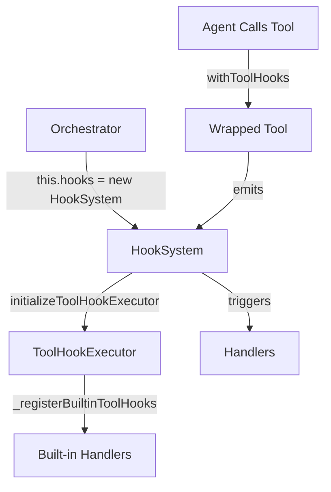

# WorkFlowAgent Enhancement Implementation Summary

## Overview

Successfully implemented three priority enhancements to WorkFlowAgent, with deep integration into the existing workflow lifecycle:

| Priority | Feature | Status | Test |
|---------|---------|--------|------|
| P1 | Tool-Level Hooks (BEFORE/AFTER) | ✅ **COMPLETE** | PASS |
| P2 | Tool Self-Description (USE WHEN / DO NOT USE) | ✅ **COMPLETE** | PASS |
| P3 | Output Style Control (PromptBuilder) | ✅ **COMPLETE** | PASS |

---

## P1: Tool-Level Hook Executor

### What Was Implemented

Created a comprehensive tool execution hook system that integrates with the existing `HookSystem`:

**New Files:**
- `workflow/tools/tool-hook-executor.js` – Core wrapper module (~300 lines)
- `workflow/tools/thick-tools-hooked.js` – Hook-enabled thick tools with metadata
- `workflow/tools/test-tool-hooks.js` – Test suite

**Modified Files:**
- `workflow/core/constants.js` – Added 5 new TOOL_* hook events
- `workflow/index.js` – Auto-initialization during Orchestrator startup
- `workflow/core/orchestrator-init.js` – Registration of built-in handlers

### Hook Events Added

```javascript
HOOK_EVENTS = {
  // ... existing events ...

  // Tool execution lifecycle events
  TOOL_EXECUTION_STARTED:   'tool_execution_started',
  TOOL_EXECUTION_COMPLETED: 'tool_execution_completed',
  TOOL_EXECUTION_FAILED:    'tool_execution_failed',
  TOOL_BEFORE_EXECUTION:    'tool_before_execution',
  TOOL_AFTER_EXECUTION:     'tool_after_execution',
};
```

### Usage Examples

**Basic Usage (Automatic):**
```javascript
// Import hooked version instead of raw tools
const { getProjectStructure } = require('./thick-tools-hooked');

// Hooks fire automatically
const result = await getProjectStructure('/project', 3);
```

**Custom Hook Handler:**
```javascript
const { HOOK_EVENTS } = require('workflow/core/constants');

// Transform parameters before execution
hooks.on(HOOK_EVENTS.TOOL_BEFORE_EXECUTION, ({ toolName, args, modifyArgs }) => {
  if (toolName === 'getProjectStructure') {
    // Auto-limit depth for large projects
    const [path, depth] = args;
    modifyArgs([path, Math.min(depth, 3)]);
  }
});

// Transform results after execution
hooks.on(HOOK_EVENTS.TOOL_AFTER_EXECUTION, ({ toolName, result, modifyResult }) => {
  if (toolName === 'scanCodeSymbols' && result.meta.estimatedTokens > 4000) {
    // Auto-compress large results
    modifyResult({ ...result, compressed: true });
  }
});
```

### Integration Point



---

## P2: Tool Self-Description

### What Was Implemented

Added comprehensive self-descriptive metadata to all thick tools, following the "USE THIS WHEN / DO NOT USE FOR" pattern.

**Format:**
```javascript
/**
 * Tool description
 *
 * 👍 USE THIS WHEN:
 *   - Scenario 1
 *   - Scenario 2
 *   - etc.
 *
 * 🚫 DO NOT USE FOR:
 *   - Anti-pattern 1
 *   - Anti-pattern 2
 *   - etc.
 *
 * @param {...}
 * @estimatedCost low|medium|high (~tokens)
 */
```

### Tools Updated

| Tool | Category | UseWhen Scenarios | DoNotUseFor Anti-Patterns |
|------|----------|-------------------|---------------------------|
| `getUnfinishedChanges` | analysis | 4 | 3 |
| `getProjectStructure` | analysis | 5 | 5 |
| `selectToolStrategy` | decision | 4 | 3 |
| `getCodebaseSummary` | analysis | 4 | 2 |
| `scanCodeSymbols` | analysis | 6 | 4 |
| `generateProjectContext` | context | 4 | 2 |

### Module-Level Guidance

Also added module-level guidance in `thick-tools.js` header:

```javascript
/**
 * Thick Tools (厚工具) – High-level summarisation scripts
 *
 * ✅ USE THIS WHEN:
 *   - Project is large (Monorepo, > 500 files)
 *   - You need a summary, not raw content
 *   - Token budget is a concern
 *   - Working with unfamiliar codebases
 *   - Need high-level architectural understanding
 *
 * 🚫 DO NOT USE FOR:
 *   - Getting specific file contents (use read_file or view_code_item)
 *   - Real-time debugging (use thin-tools for direct access)
 *   - One-off file reads on small projects (< 100 files)
 *   - Precise symbol lookups (use codebase_search or grep_search)
 */
```

### Introspection API

```javascript
const hookedTools = require('./thick-tools-hooked');

// List all tools with metadata
const tools = hookedTools.listTools();
// => [
//   { name: 'getProjectStructure', category: 'analysis', description: '...', useWhen: [...], doNotUseFor: [...] },
//   ...
// ]

// Get specific tool metadata
const meta = hookedTools.getToolMetadata('getProjectStructure');
```

---

## P3: Output Style Control

### What Was Implemented

Added `outputStyle` parameter to `buildAgentPrompt()` that injects style instructions into agent prompts.

**Modified Files:**
- `workflow/core/prompt-builder.js` – Added OUTPUT_STYLES and style injection

### Output Styles Available

| Style | Purpose | Use Case |
|-------|---------|----------|
| `concise` | Brief responses, minimal explanation | Token-constrained scenarios, quick queries |
| `verbose` | Detailed with full explanations | Complex tasks requiring rationale |
| `structured` | Strictly formatted sections | Documentation generation, reports |
| `analytical` | Pros/cons, tradeoffs discussion | Architecture decisions, code reviews |
| `stepByStep` | Sequential numbered steps | Tutorials, guided modifications |

### Usage

```javascript
const { buildAgentPrompt, OUTPUT_STYLES } = require('./prompt-builder');

// Use structured output for documentation tasks
const result = buildAgentPrompt('architect', analysisInput, [], {
  outputStyle: 'structured'
});

// Style instruction is automatically injected into prompt
console.log(result.prompt);  // Contains "## Output Style: STRUCTURED"
console.log(result.meta.outputStyle);  // 'structured'

// Available for introspection
console.log(OUTPUT_STYLES.structured.description);
// => 'Strictly formatted responses with sections'
```

### Style Injection Flow

```
buildAgentPrompt(role, input, files, { outputStyle: 'concise' })
  └── _resolveFixedPrefix(role) → fixedPrefix
  └── Inject: fixedPrefix + '\n\n' + OUTPUT_STYLES.concise.instruction
  └── Assemble KV Cache friendly prompt
  └── Return with meta.outputStyle = 'concise'
```

---

## Integration with Existing Workflow

### Automatic Initialization

All three features are automatically initialized during Orchestrator startup:

```javascript
// In workflow/index.js (line ~233)
// P1: Initialize Tool Hook Executor for automatic tool execution hooks
const { initializeToolHookExecutor } = require('./tools/tool-hook-executor');
initializeToolHookExecutor(this.hooks, { enabled: true });

// In workflow/core/orchestrator-init.js (Step 13)
// Register built-in Tool Hook handlers for observability
const { _registerBuiltinToolHooks } = require('../tools/tool-hook-executor');
_registerBuiltinToolHooks(this.hooks);
```

### Hook Event Subscription

Built-in handlers automatically subscribe to tool events:

```javascript
// Automatically logs all tool execution
[ToolHook] 🔧 getProjectStructure started [analysis]
[ToolHook] ✅ getProjectStructure completed (120ms)
```

---

## Testing

Run the test suite:

```bash
cd workflow/tools
node test-tool-hooks.js
```

**Expected Output:**
```
============================================================
Test Summary
============================================================
P1 - Tool Hook Executor:      ✅ PASS
P2 - Tool Self-Description:   ✅ PASS
P3 - Output Style Control:    ✅ PASS
============================================================
```

---

## Benefits Summary

### P1: Tool Hooks
- ✅ Token compression at tool level (not just prompt level)
- ✅ Result filtering and transformation
- ✅ Execution logging and observability
- ✅ Retry logic injection
- ✅ Cost tracking per tool call

### P2: Self-Description
- ✅ Reduces agent tool misselection
- ✅ Clear guidance on when/why to use tools
- ✅ Improves first-time developer experience
- ✅ Reduces hallucination from wrong tool usage

### P3: Output Styles
- ✅ Consistent response formatting
- ✅ Token optimization via `concise` mode
- ✅ Better documentation with `structured` mode
- ✅ Improved code reviews with `analytical` mode

---

## API Quick Reference

```javascript
// P1: Tool Hooks
const { withToolHooks, withBatchToolHooks } = require('./tools/tool-hook-executor');
const hookedTool = withToolHooks(toolFn, 'toolName', { category: 'analysis' });

// P2: Tool Self-Description
const { listTools, getToolMetadata, TOOL_METADATA } = require('./tools/thick-tools-hooked');

// P3: Output Styles
const { buildAgentPrompt, OUTPUT_STYLES } = require('./core/prompt-builder');
const result = buildAgentPrompt('developer', input, [], { outputStyle: 'structured' });
```

---

**Implementation Date:** 2026-03-26  
**Test Status:** All Tests Passing ✅  
**Documentation:** Complete ✅
